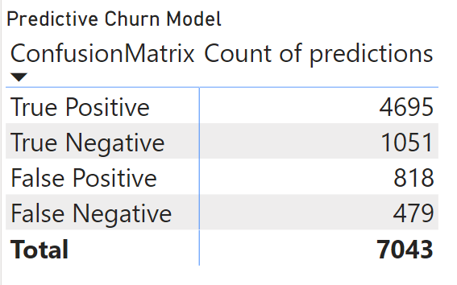
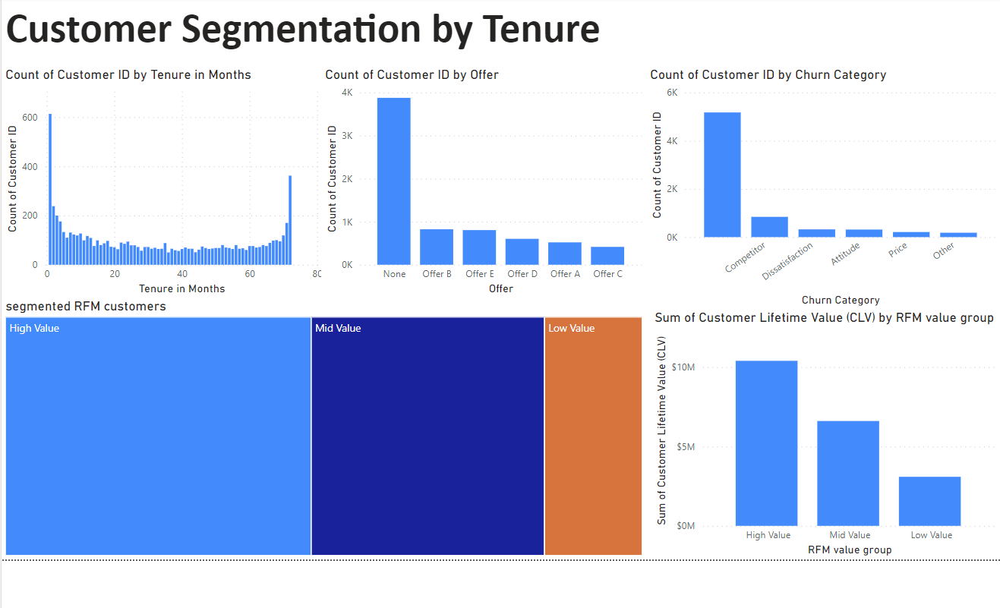
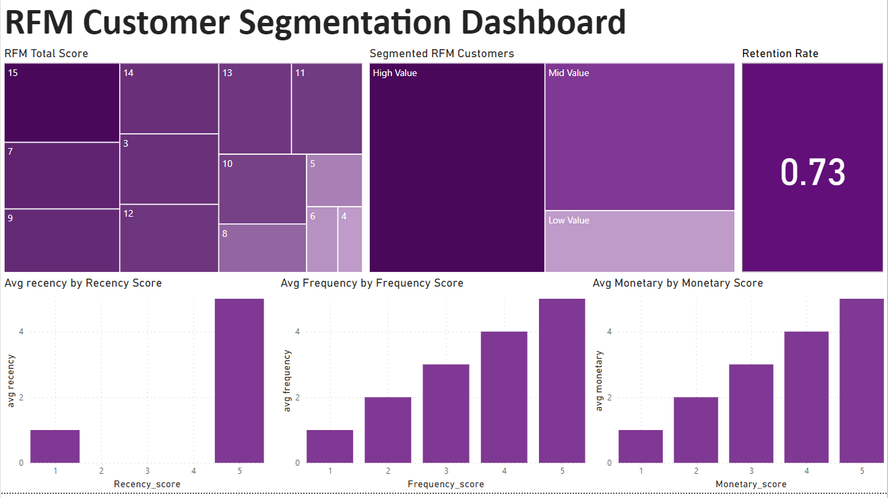

## Customer Segmentation dashboard in powerBI

# predictive churn model using random forests

import pandas as pd
from sklearn.model_selection import train_test_split, cross_val_score
from sklearn.preprocessing import LabelEncoder
from sklearn.ensemble import RandomForestClassifier
from sklearn.metrics import accuracy_score

# Encode target
label_encoder = LabelEncoder()
dataset['Churn_Status_Encoded'] = label_encoder.fit_transform(dataset['Churn_Status'])

# Drop the 'Churn_Status' column
dataset = dataset.drop(columns=['Churn_Status', 'Customer Status'])

# One-hot encoding for categorical columns
dataset = pd.get_dummies(dataset)

# Prepare X and y for the classifier
X = dataset.drop(columns=['Churn_Status_Encoded'])
y = dataset['Churn_Status_Encoded']

# Split data into train and test sets
X_train, X_test, y_train, y_test = train_test_split(X, y, test_size=0.2, random_state=42)

# Train the model
rf_classifier = RandomForestClassifier(random_state=42, n_estimators=100, max_depth=None, min_samples_split=2, max_features='auto')
rf_classifier.fit(X_train, y_train)

# cross-validation
cv_scores = cross_val_score(rf_classifier, X, y, cv=5)

y_pred = rf_classifier.predict(X_test)
accuracy = accuracy_score(y_test, y_pred)

dataset.insert(4, "predictions", rf_classifier.predict(X))


# Confusion Matrix Visualization
# 


```python

```

# Customer Segmentation by Tenure
# 

# RFM Customer segmentation Dashboard
# 
