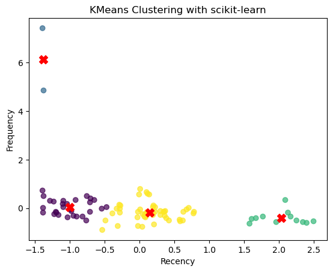

```python
pip install tensorflow
```

    Defaulting to user installation because normal site-packages is not writeable
    Requirement already satisfied: tensorflow in c:\users\samuel d h\appdata\roaming\python\python310\site-packages (2.15.0)
    Requirement already satisfied: tensorflow-intel==2.15.0 in c:\users\samuel d h\appdata\roaming\python\python310\site-packages (from tensorflow) (2.15.0)
    Requirement already satisfied: protobuf!=4.21.0,!=4.21.1,!=4.21.2,!=4.21.3,!=4.21.4,!=4.21.5,<5.0.0dev,>=3.20.3 in c:\users\samuel d h\appdata\roaming\python\python310\site-packages (from tensorflow-intel==2.15.0->tensorflow) (4.23.4)
    Requirement already satisfied: tensorboard<2.16,>=2.15 in c:\users\samuel d h\appdata\roaming\python\python310\site-packages (from tensorflow-intel==2.15.0->tensorflow) (2.15.1)
    Requirement already satisfied: astunparse>=1.6.0 in c:\users\samuel d h\appdata\roaming\python\python310\site-packages (from tensorflow-intel==2.15.0->tensorflow) (1.6.3)
    Requirement already satisfied: six>=1.12.0 in c:\programdata\anaconda\lib\site-packages (from tensorflow-intel==2.15.0->tensorflow) (1.16.0)
    Requirement already satisfied: wrapt<1.15,>=1.11.0 in c:\programdata\anaconda\lib\site-packages (from tensorflow-intel==2.15.0->tensorflow) (1.14.1)
    Requirement already satisfied: h5py>=2.9.0 in c:\programdata\anaconda\lib\site-packages (from tensorflow-intel==2.15.0->tensorflow) (3.7.0)
    Requirement already satisfied: setuptools in c:\programdata\anaconda\lib\site-packages (from tensorflow-intel==2.15.0->tensorflow) (65.6.3)
    Requirement already satisfied: flatbuffers>=23.5.26 in c:\users\samuel d h\appdata\roaming\python\python310\site-packages (from tensorflow-intel==2.15.0->tensorflow) (23.5.26)
    Requirement already satisfied: typing-extensions>=3.6.6 in c:\programdata\anaconda\lib\site-packages (from tensorflow-intel==2.15.0->tensorflow) (4.4.0)
    Requirement already satisfied: tensorflow-io-gcs-filesystem>=0.23.1 in c:\users\samuel d h\appdata\roaming\python\python310\site-packages (from tensorflow-intel==2.15.0->tensorflow) (0.31.0)
    Requirement already satisfied: grpcio<2.0,>=1.24.3 in c:\users\samuel d h\appdata\roaming\python\python310\site-packages (from tensorflow-intel==2.15.0->tensorflow) (1.60.0)
    Requirement already satisfied: keras<2.16,>=2.15.0 in c:\users\samuel d h\appdata\roaming\python\python310\site-packages (from tensorflow-intel==2.15.0->tensorflow) (2.15.0)
    Requirement already satisfied: gast!=0.5.0,!=0.5.1,!=0.5.2,>=0.2.1 in c:\users\samuel d h\appdata\roaming\python\python310\site-packages (from tensorflow-intel==2.15.0->tensorflow) (0.5.4)
    Requirement already satisfied: libclang>=13.0.0 in c:\users\samuel d h\appdata\roaming\python\python310\site-packages (from tensorflow-intel==2.15.0->tensorflow) (16.0.6)
    Requirement already satisfied: termcolor>=1.1.0 in c:\users\samuel d h\appdata\roaming\python\python310\site-packages (from tensorflow-intel==2.15.0->tensorflow) (2.4.0)
    Requirement already satisfied: ml-dtypes~=0.2.0 in c:\users\samuel d h\appdata\roaming\python\python310\site-packages (from tensorflow-intel==2.15.0->tensorflow) (0.2.0)
    Requirement already satisfied: absl-py>=1.0.0 in c:\users\samuel d h\appdata\roaming\python\python310\site-packages (from tensorflow-intel==2.15.0->tensorflow) (2.0.0)
    Requirement already satisfied: tensorflow-estimator<2.16,>=2.15.0 in c:\users\samuel d h\appdata\roaming\python\python310\site-packages (from tensorflow-intel==2.15.0->tensorflow) (2.15.0)
    Requirement already satisfied: google-pasta>=0.1.1 in c:\users\samuel d h\appdata\roaming\python\python310\site-packages (from tensorflow-intel==2.15.0->tensorflow) (0.2.0)
    Requirement already satisfied: numpy<2.0.0,>=1.23.5 in c:\programdata\anaconda\lib\site-packages (from tensorflow-intel==2.15.0->tensorflow) (1.23.5)
    Requirement already satisfied: packaging in c:\programdata\anaconda\lib\site-packages (from tensorflow-intel==2.15.0->tensorflow) (22.0)
    Requirement already satisfied: opt-einsum>=2.3.2 in c:\users\samuel d h\appdata\roaming\python\python310\site-packages (from tensorflow-intel==2.15.0->tensorflow) (3.3.0)
    Requirement already satisfied: wheel<1.0,>=0.23.0 in c:\programdata\anaconda\lib\site-packages (from astunparse>=1.6.0->tensorflow-intel==2.15.0->tensorflow) (0.38.4)
    Requirement already satisfied: google-auth-oauthlib<2,>=0.5 in c:\users\samuel d h\appdata\roaming\python\python310\site-packages (from tensorboard<2.16,>=2.15->tensorflow-intel==2.15.0->tensorflow) (1.2.0)
    Requirement already satisfied: markdown>=2.6.8 in c:\programdata\anaconda\lib\site-packages (from tensorboard<2.16,>=2.15->tensorflow-intel==2.15.0->tensorflow) (3.4.1)
    Requirement already satisfied: requests<3,>=2.21.0 in c:\programdata\anaconda\lib\site-packages (from tensorboard<2.16,>=2.15->tensorflow-intel==2.15.0->tensorflow) (2.28.1)
    Requirement already satisfied: werkzeug>=1.0.1 in c:\programdata\anaconda\lib\site-packages (from tensorboard<2.16,>=2.15->tensorflow-intel==2.15.0->tensorflow) (2.2.2)
    Requirement already satisfied: google-auth<3,>=1.6.3 in c:\users\samuel d h\appdata\roaming\python\python310\site-packages (from tensorboard<2.16,>=2.15->tensorflow-intel==2.15.0->tensorflow) (2.25.2)
    Requirement already satisfied: tensorboard-data-server<0.8.0,>=0.7.0 in c:\users\samuel d h\appdata\roaming\python\python310\site-packages (from tensorboard<2.16,>=2.15->tensorflow-intel==2.15.0->tensorflow) (0.7.2)
    Requirement already satisfied: pyasn1-modules>=0.2.1 in c:\programdata\anaconda\lib\site-packages (from google-auth<3,>=1.6.3->tensorboard<2.16,>=2.15->tensorflow-intel==2.15.0->tensorflow) (0.2.8)
    Requirement already satisfied: rsa<5,>=3.1.4 in c:\users\samuel d h\appdata\roaming\python\python310\site-packages (from google-auth<3,>=1.6.3->tensorboard<2.16,>=2.15->tensorflow-intel==2.15.0->tensorflow) (4.9)
    Requirement already satisfied: cachetools<6.0,>=2.0.0 in c:\users\samuel d h\appdata\roaming\python\python310\site-packages (from google-auth<3,>=1.6.3->tensorboard<2.16,>=2.15->tensorflow-intel==2.15.0->tensorflow) (5.3.2)
    Requirement already satisfied: requests-oauthlib>=0.7.0 in c:\users\samuel d h\appdata\roaming\python\python310\site-packages (from google-auth-oauthlib<2,>=0.5->tensorboard<2.16,>=2.15->tensorflow-intel==2.15.0->tensorflow) (1.3.1)
    Requirement already satisfied: idna<4,>=2.5 in c:\programdata\anaconda\lib\site-packages (from requests<3,>=2.21.0->tensorboard<2.16,>=2.15->tensorflow-intel==2.15.0->tensorflow) (3.4)
    Requirement already satisfied: certifi>=2017.4.17 in c:\programdata\anaconda\lib\site-packages (from requests<3,>=2.21.0->tensorboard<2.16,>=2.15->tensorflow-intel==2.15.0->tensorflow) (2022.12.7)
    Requirement already satisfied: urllib3<1.27,>=1.21.1 in c:\programdata\anaconda\lib\site-packages (from requests<3,>=2.21.0->tensorboard<2.16,>=2.15->tensorflow-intel==2.15.0->tensorflow) (1.26.14)
    Requirement already satisfied: charset-normalizer<3,>=2 in c:\programdata\anaconda\lib\site-packages (from requests<3,>=2.21.0->tensorboard<2.16,>=2.15->tensorflow-intel==2.15.0->tensorflow) (2.0.4)
    Requirement already satisfied: MarkupSafe>=2.1.1 in c:\programdata\anaconda\lib\site-packages (from werkzeug>=1.0.1->tensorboard<2.16,>=2.15->tensorflow-intel==2.15.0->tensorflow) (2.1.1)
    Requirement already satisfied: pyasn1<0.5.0,>=0.4.6 in c:\programdata\anaconda\lib\site-packages (from pyasn1-modules>=0.2.1->google-auth<3,>=1.6.3->tensorboard<2.16,>=2.15->tensorflow-intel==2.15.0->tensorflow) (0.4.8)
    Requirement already satisfied: oauthlib>=3.0.0 in c:\users\samuel d h\appdata\roaming\python\python310\site-packages (from requests-oauthlib>=0.7.0->google-auth-oauthlib<2,>=0.5->tensorboard<2.16,>=2.15->tensorflow-intel==2.15.0->tensorflow) (3.2.2)
    Note: you may need to restart the kernel to use updated packages.
    


```python
import pandas as pd
import numpy as np
import datetime as dt
import tensorflow as tf
import matplotlib.pyplot as plt
from sklearn.cluster import KMeans
from sklearn.preprocessing import StandardScaler
from sklearn.metrics import silhouette_score
```


```python
df = pd.read_csv("sales_data_sample.csv", encoding='unicode_escape')
```


```python
df.head()
```


<div>
<style scoped>
    .dataframe tbody tr th:only-of-type {
        vertical-align: middle;
    }

    .dataframe tbody tr th {
        vertical-align: top;
    }

    .dataframe thead th {
        text-align: right;
    }
</style>
<table border="1" class="dataframe">
  <thead>
    <tr style="text-align: right;">
      <th></th>
      <th>ORDERNUMBER</th>
      <th>QUANTITYORDERED</th>
      <th>PRICEEACH</th>
      <th>ORDERLINENUMBER</th>
      <th>SALES</th>
      <th>ORDERDATE</th>
      <th>STATUS</th>
      <th>QTR_ID</th>
      <th>MONTH_ID</th>
      <th>YEAR_ID</th>
      <th>...</th>
      <th>ADDRESSLINE1</th>
      <th>ADDRESSLINE2</th>
      <th>CITY</th>
      <th>STATE</th>
      <th>POSTALCODE</th>
      <th>COUNTRY</th>
      <th>TERRITORY</th>
      <th>CONTACTLASTNAME</th>
      <th>CONTACTFIRSTNAME</th>
      <th>DEALSIZE</th>
    </tr>
  </thead>
  <tbody>
    <tr>
      <th>0</th>
      <td>10107</td>
      <td>30</td>
      <td>95.70</td>
      <td>2</td>
      <td>2871.00</td>
      <td>2/24/2003 0:00</td>
      <td>Shipped</td>
      <td>1</td>
      <td>2</td>
      <td>2003</td>
      <td>...</td>
      <td>897 Long Airport Avenue</td>
      <td>NaN</td>
      <td>NYC</td>
      <td>NY</td>
      <td>10022</td>
      <td>USA</td>
      <td>NaN</td>
      <td>Yu</td>
      <td>Kwai</td>
      <td>Small</td>
    </tr>
    <tr>
      <th>1</th>
      <td>10121</td>
      <td>34</td>
      <td>81.35</td>
      <td>5</td>
      <td>2765.90</td>
      <td>5/7/2003 0:00</td>
      <td>Shipped</td>
      <td>2</td>
      <td>5</td>
      <td>2003</td>
      <td>...</td>
      <td>59 rue de l'Abbaye</td>
      <td>NaN</td>
      <td>Reims</td>
      <td>NaN</td>
      <td>51100</td>
      <td>France</td>
      <td>EMEA</td>
      <td>Henriot</td>
      <td>Paul</td>
      <td>Small</td>
    </tr>
    <tr>
      <th>2</th>
      <td>10134</td>
      <td>41</td>
      <td>94.74</td>
      <td>2</td>
      <td>3884.34</td>
      <td>7/1/2003 0:00</td>
      <td>Shipped</td>
      <td>3</td>
      <td>7</td>
      <td>2003</td>
      <td>...</td>
      <td>27 rue du Colonel Pierre Avia</td>
      <td>NaN</td>
      <td>Paris</td>
      <td>NaN</td>
      <td>75508</td>
      <td>France</td>
      <td>EMEA</td>
      <td>Da Cunha</td>
      <td>Daniel</td>
      <td>Medium</td>
    </tr>
    <tr>
      <th>3</th>
      <td>10145</td>
      <td>45</td>
      <td>83.26</td>
      <td>6</td>
      <td>3746.70</td>
      <td>8/25/2003 0:00</td>
      <td>Shipped</td>
      <td>3</td>
      <td>8</td>
      <td>2003</td>
      <td>...</td>
      <td>78934 Hillside Dr.</td>
      <td>NaN</td>
      <td>Pasadena</td>
      <td>CA</td>
      <td>90003</td>
      <td>USA</td>
      <td>NaN</td>
      <td>Young</td>
      <td>Julie</td>
      <td>Medium</td>
    </tr>
    <tr>
      <th>4</th>
      <td>10159</td>
      <td>49</td>
      <td>100.00</td>
      <td>14</td>
      <td>5205.27</td>
      <td>10/10/2003 0:00</td>
      <td>Shipped</td>
      <td>4</td>
      <td>10</td>
      <td>2003</td>
      <td>...</td>
      <td>7734 Strong St.</td>
      <td>NaN</td>
      <td>San Francisco</td>
      <td>CA</td>
      <td>NaN</td>
      <td>USA</td>
      <td>NaN</td>
      <td>Brown</td>
      <td>Julie</td>
      <td>Medium</td>
    </tr>
  </tbody>
</table>
<p>5 rows × 25 columns</p>
</div>


```python
df.shape
```


    (2823, 25)


```python
df.isnull().sum()
```


    ORDERNUMBER            0
    QUANTITYORDERED        0
    PRICEEACH              0
    ORDERLINENUMBER        0
    SALES                  0
    ORDERDATE              0
    STATUS                 0
    QTR_ID                 0
    MONTH_ID               0
    YEAR_ID                0
    PRODUCTLINE            0
    MSRP                   0
    PRODUCTCODE            0
    CUSTOMERNAME           0
    PHONE                  0
    ADDRESSLINE1           0
    ADDRESSLINE2        2521
    CITY                   0
    STATE               1486
    POSTALCODE            76
    COUNTRY                0
    TERRITORY           1074
    CONTACTLASTNAME        0
    CONTACTFIRSTNAME       0
    DEALSIZE               0
    dtype: int64


```python
df['ORDERDATE'] = pd.to_datetime(df['ORDERDATE'])
```


```python
df.head()
```


<div>
<style scoped>
    .dataframe tbody tr th:only-of-type {
        vertical-align: middle;
    }

    .dataframe tbody tr th {
        vertical-align: top;
    }

    .dataframe thead th {
        text-align: right;
    }
</style>
<table border="1" class="dataframe">
  <thead>
    <tr style="text-align: right;">
      <th></th>
      <th>ORDERNUMBER</th>
      <th>QUANTITYORDERED</th>
      <th>PRICEEACH</th>
      <th>ORDERLINENUMBER</th>
      <th>SALES</th>
      <th>ORDERDATE</th>
      <th>STATUS</th>
      <th>QTR_ID</th>
      <th>MONTH_ID</th>
      <th>YEAR_ID</th>
      <th>...</th>
      <th>ADDRESSLINE1</th>
      <th>ADDRESSLINE2</th>
      <th>CITY</th>
      <th>STATE</th>
      <th>POSTALCODE</th>
      <th>COUNTRY</th>
      <th>TERRITORY</th>
      <th>CONTACTLASTNAME</th>
      <th>CONTACTFIRSTNAME</th>
      <th>DEALSIZE</th>
    </tr>
  </thead>
  <tbody>
    <tr>
      <th>0</th>
      <td>10107</td>
      <td>30</td>
      <td>95.70</td>
      <td>2</td>
      <td>2871.00</td>
      <td>2003-02-24</td>
      <td>Shipped</td>
      <td>1</td>
      <td>2</td>
      <td>2003</td>
      <td>...</td>
      <td>897 Long Airport Avenue</td>
      <td>NaN</td>
      <td>NYC</td>
      <td>NY</td>
      <td>10022</td>
      <td>USA</td>
      <td>NaN</td>
      <td>Yu</td>
      <td>Kwai</td>
      <td>Small</td>
    </tr>
    <tr>
      <th>1</th>
      <td>10121</td>
      <td>34</td>
      <td>81.35</td>
      <td>5</td>
      <td>2765.90</td>
      <td>2003-05-07</td>
      <td>Shipped</td>
      <td>2</td>
      <td>5</td>
      <td>2003</td>
      <td>...</td>
      <td>59 rue de l'Abbaye</td>
      <td>NaN</td>
      <td>Reims</td>
      <td>NaN</td>
      <td>51100</td>
      <td>France</td>
      <td>EMEA</td>
      <td>Henriot</td>
      <td>Paul</td>
      <td>Small</td>
    </tr>
    <tr>
      <th>2</th>
      <td>10134</td>
      <td>41</td>
      <td>94.74</td>
      <td>2</td>
      <td>3884.34</td>
      <td>2003-07-01</td>
      <td>Shipped</td>
      <td>3</td>
      <td>7</td>
      <td>2003</td>
      <td>...</td>
      <td>27 rue du Colonel Pierre Avia</td>
      <td>NaN</td>
      <td>Paris</td>
      <td>NaN</td>
      <td>75508</td>
      <td>France</td>
      <td>EMEA</td>
      <td>Da Cunha</td>
      <td>Daniel</td>
      <td>Medium</td>
    </tr>
    <tr>
      <th>3</th>
      <td>10145</td>
      <td>45</td>
      <td>83.26</td>
      <td>6</td>
      <td>3746.70</td>
      <td>2003-08-25</td>
      <td>Shipped</td>
      <td>3</td>
      <td>8</td>
      <td>2003</td>
      <td>...</td>
      <td>78934 Hillside Dr.</td>
      <td>NaN</td>
      <td>Pasadena</td>
      <td>CA</td>
      <td>90003</td>
      <td>USA</td>
      <td>NaN</td>
      <td>Young</td>
      <td>Julie</td>
      <td>Medium</td>
    </tr>
    <tr>
      <th>4</th>
      <td>10159</td>
      <td>49</td>
      <td>100.00</td>
      <td>14</td>
      <td>5205.27</td>
      <td>2003-10-10</td>
      <td>Shipped</td>
      <td>4</td>
      <td>10</td>
      <td>2003</td>
      <td>...</td>
      <td>7734 Strong St.</td>
      <td>NaN</td>
      <td>San Francisco</td>
      <td>CA</td>
      <td>NaN</td>
      <td>USA</td>
      <td>NaN</td>
      <td>Brown</td>
      <td>Julie</td>
      <td>Medium</td>
    </tr>
  </tbody>
</table>
<p>5 rows × 25 columns</p>
</div>


# creating RFM scores
- we will be assuming the snapshot date of the latest date available in the dataset, since using the current date will skew the data heavily

Recency = number of days between customer's last order to the recent date snapshot

frequency = number of purchases from the customer

monetary value = total revenue value from customer


```python
snapshot_date = df['ORDERDATE'].max() + dt.timedelta(days=1)

df_rfm = df.groupby(['CUSTOMERNAME']).agg({
    'ORDERDATE': lambda x: (snapshot_date - x.max
()).days, 
    'ORDERNUMBER':'count',
    'SALES':'sum'})
```


```python
#renaming columns to Recency, frequency, monetary 
df_rfm.rename(columns={'ORDERDATE': 'Recency',
                   'ORDERNUMBER': 'Frequency',
                   'SALES': 'Monetary'}, inplace=True)
```


```python
df_rfm.head()
```


<div>
<style scoped>
    .dataframe tbody tr th:only-of-type {
        vertical-align: middle;
    }

    .dataframe tbody tr th {
        vertical-align: top;
    }

    .dataframe thead th {
        text-align: right;
    }
</style>
<table border="1" class="dataframe">
  <thead>
    <tr style="text-align: right;">
      <th></th>
      <th>Recency</th>
      <th>Frequency</th>
      <th>Monetary</th>
    </tr>
    <tr>
      <th>CUSTOMERNAME</th>
      <th></th>
      <th></th>
      <th></th>
    </tr>
  </thead>
  <tbody>
    <tr>
      <th>AV Stores, Co.</th>
      <td>196</td>
      <td>51</td>
      <td>157807.81</td>
    </tr>
    <tr>
      <th>Alpha Cognac</th>
      <td>65</td>
      <td>20</td>
      <td>70488.44</td>
    </tr>
    <tr>
      <th>Amica Models &amp; Co.</th>
      <td>265</td>
      <td>26</td>
      <td>94117.26</td>
    </tr>
    <tr>
      <th>Anna's Decorations, Ltd</th>
      <td>84</td>
      <td>46</td>
      <td>153996.13</td>
    </tr>
    <tr>
      <th>Atelier graphique</th>
      <td>188</td>
      <td>7</td>
      <td>24179.96</td>
    </tr>
  </tbody>
</table>
</div>


```python


```


```python

features = df_rfm[['Recency', 'Frequency', 'Monetary']]
scaler = StandardScaler()
features_scaled = scaler.fit_transform(features)

# Elbow Method 
inertia_values = []
silhouette_scores = []
max_clusters = 10

for num_clusters in range(2, max_clusters + 1):  # Start from 2 clusters
    kmeans = KMeans(n_clusters=num_clusters, random_state=42)
    
    
    kmeans.fit(features_scaled)
    
    labels = kmeans.predict(features_scaled)
    
    inertia_values.append(kmeans.inertia_)
    
    #silhouette score
    silhouette_scores.append(silhouette_score(features_scaled, labels))


```

    C:\ProgramData\anaconda\lib\site-packages\sklearn\cluster\_kmeans.py:870: FutureWarning: The default value of `n_init` will change from 10 to 'auto' in 1.4. Set the value of `n_init` explicitly to suppress the warning
      warnings.warn(
    C:\ProgramData\anaconda\lib\site-packages\sklearn\cluster\_kmeans.py:1382: UserWarning: KMeans is known to have a memory leak on Windows with MKL, when there are less chunks than available threads. You can avoid it by setting the environment variable OMP_NUM_THREADS=1.
      warnings.warn(
    C:\ProgramData\anaconda\lib\site-packages\sklearn\cluster\_kmeans.py:870: FutureWarning: The default value of `n_init` will change from 10 to 'auto' in 1.4. Set the value of `n_init` explicitly to suppress the warning
      warnings.warn(
    C:\ProgramData\anaconda\lib\site-packages\sklearn\cluster\_kmeans.py:1382: UserWarning: KMeans is known to have a memory leak on Windows with MKL, when there are less chunks than available threads. You can avoid it by setting the environment variable OMP_NUM_THREADS=1.
      warnings.warn(
    C:\ProgramData\anaconda\lib\site-packages\sklearn\cluster\_kmeans.py:870: FutureWarning: The default value of `n_init` will change from 10 to 'auto' in 1.4. Set the value of `n_init` explicitly to suppress the warning
      warnings.warn(
    C:\ProgramData\anaconda\lib\site-packages\sklearn\cluster\_kmeans.py:1382: UserWarning: KMeans is known to have a memory leak on Windows with MKL, when there are less chunks than available threads. You can avoid it by setting the environment variable OMP_NUM_THREADS=1.
      warnings.warn(
    C:\ProgramData\anaconda\lib\site-packages\sklearn\cluster\_kmeans.py:870: FutureWarning: The default value of `n_init` will change from 10 to 'auto' in 1.4. Set the value of `n_init` explicitly to suppress the warning
      warnings.warn(
    C:\ProgramData\anaconda\lib\site-packages\sklearn\cluster\_kmeans.py:1382: UserWarning: KMeans is known to have a memory leak on Windows with MKL, when there are less chunks than available threads. You can avoid it by setting the environment variable OMP_NUM_THREADS=1.
      warnings.warn(
    C:\ProgramData\anaconda\lib\site-packages\sklearn\cluster\_kmeans.py:870: FutureWarning: The default value of `n_init` will change from 10 to 'auto' in 1.4. Set the value of `n_init` explicitly to suppress the warning
      warnings.warn(
    C:\ProgramData\anaconda\lib\site-packages\sklearn\cluster\_kmeans.py:1382: UserWarning: KMeans is known to have a memory leak on Windows with MKL, when there are less chunks than available threads. You can avoid it by setting the environment variable OMP_NUM_THREADS=1.
      warnings.warn(
    C:\ProgramData\anaconda\lib\site-packages\sklearn\cluster\_kmeans.py:870: FutureWarning: The default value of `n_init` will change from 10 to 'auto' in 1.4. Set the value of `n_init` explicitly to suppress the warning
      warnings.warn(
    C:\ProgramData\anaconda\lib\site-packages\sklearn\cluster\_kmeans.py:1382: UserWarning: KMeans is known to have a memory leak on Windows with MKL, when there are less chunks than available threads. You can avoid it by setting the environment variable OMP_NUM_THREADS=1.
      warnings.warn(
    C:\ProgramData\anaconda\lib\site-packages\sklearn\cluster\_kmeans.py:870: FutureWarning: The default value of `n_init` will change from 10 to 'auto' in 1.4. Set the value of `n_init` explicitly to suppress the warning
      warnings.warn(
    C:\ProgramData\anaconda\lib\site-packages\sklearn\cluster\_kmeans.py:1382: UserWarning: KMeans is known to have a memory leak on Windows with MKL, when there are less chunks than available threads. You can avoid it by setting the environment variable OMP_NUM_THREADS=1.
      warnings.warn(
    C:\ProgramData\anaconda\lib\site-packages\sklearn\cluster\_kmeans.py:870: FutureWarning: The default value of `n_init` will change from 10 to 'auto' in 1.4. Set the value of `n_init` explicitly to suppress the warning
      warnings.warn(
    C:\ProgramData\anaconda\lib\site-packages\sklearn\cluster\_kmeans.py:1382: UserWarning: KMeans is known to have a memory leak on Windows with MKL, when there are less chunks than available threads. You can avoid it by setting the environment variable OMP_NUM_THREADS=1.
      warnings.warn(
    C:\ProgramData\anaconda\lib\site-packages\sklearn\cluster\_kmeans.py:870: FutureWarning: The default value of `n_init` will change from 10 to 'auto' in 1.4. Set the value of `n_init` explicitly to suppress the warning
      warnings.warn(
    C:\ProgramData\anaconda\lib\site-packages\sklearn\cluster\_kmeans.py:1382: UserWarning: KMeans is known to have a memory leak on Windows with MKL, when there are less chunks than available threads. You can avoid it by setting the environment variable OMP_NUM_THREADS=1.
      warnings.warn(
    


```python
plt.figure(figsize=(12, 4))

plt.subplot(1, 2, 1)
plt.plot(range(2, max_clusters + 1), inertia_values, marker='o')
plt.title('Elbow Method - Inertia')
plt.xlabel('Number of Clusters')
plt.ylabel('Inertia')

plt.subplot(1, 2, 2)
plt.plot(range(2, max_clusters + 1), silhouette_scores, marker='o')
plt.title('Elbow Method - Silhouette Score')
plt.xlabel('Number of Clusters')
plt.ylabel('Silhouette Score')

plt.tight_layout()
plt.show()
```


    

    


```python
features = df_rfm[['Recency', 'Frequency', 'Monetary']]

scaler = StandardScaler()
features_scaled = scaler.fit_transform(features)

optimal_num_clusters = 4  

# Initialize KMeans model
kmeans = KMeans(n_clusters=optimal_num_clusters, random_state=42)

# Fitting the model
kmeans.fit(features_scaled)

# Predict cluster 
cluster_indices = kmeans.predict(features_scaled)

df_rfm['Cluster'] = cluster_indices

# plotting clusters
plt.scatter(features_scaled[:, 0], features_scaled[:, 1], c=cluster_indices, cmap='viridis', alpha=0.7)
plt.scatter(kmeans.cluster_centers_[:, 0], kmeans.cluster_centers_[:, 1], c='red', marker='X', s=100)
plt.title('KMeans Clustering with scikit-learn')
plt.xlabel('Recency')
plt.ylabel('Frequency')
plt.show()
```

    C:\ProgramData\anaconda\lib\site-packages\sklearn\cluster\_kmeans.py:870: FutureWarning: The default value of `n_init` will change from 10 to 'auto' in 1.4. Set the value of `n_init` explicitly to suppress the warning
      warnings.warn(
    C:\ProgramData\anaconda\lib\site-packages\sklearn\cluster\_kmeans.py:1382: UserWarning: KMeans is known to have a memory leak on Windows with MKL, when there are less chunks than available threads. You can avoid it by setting the environment variable OMP_NUM_THREADS=1.
      warnings.warn(
    


    

    


```python
from scipy.spatial import ConvexHull
from mpl_toolkits.mplot3d import Axes3D
# Standardize the features
scaler = StandardScaler()
features_scaled = scaler.fit_transform(features)

# Choose the optimal number of clusters based on the Elbow Method
optimal_num_clusters = 4  # Replace with the number you determined

#KMeans model
kmeans = KMeans(n_clusters=optimal_num_clusters, random_state=42)

# Fit the model to the standardized features
kmeans.fit(features_scaled)
cluster_indices = kmeans.predict(features_scaled)

df_rfm['Cluster'] = cluster_indices

#3D plot
fig = plt.figure(figsize=(10, 8))
ax = fig.add_subplot(111, projection='3d')

# Plot each cluster
for cluster_label in df_rfm['Cluster'].unique():
    cluster_data = df_rfm[df_rfm['Cluster'] == cluster_label]
    ax.scatter(cluster_data['Recency'], cluster_data['Frequency'], cluster_data['Monetary'], label=f'Cluster {cluster_label}')

# Plot convex hulls for each cluster
for cluster_label in df_rfm['Cluster'].unique():
    cluster_data = df_rfm[df_rfm['Cluster'] == cluster_label][['Recency', 'Frequency', 'Monetary']]
    

    if len(cluster_data.drop_duplicates()) > 3:
        hull = ConvexHull(cluster_data)
        ax.plot_trisurf(cluster_data['Recency'], cluster_data['Frequency'], cluster_data['Monetary'], color='gray', alpha=0.1)

ax.set_xlabel('Recency')
ax.set_ylabel('Frequency')
ax.set_zlabel('Monetary')
ax.set_title('KMeans Clustering in 3D')
ax.legend()

plt.show()
```

    C:\ProgramData\anaconda\lib\site-packages\sklearn\cluster\_kmeans.py:870: FutureWarning: The default value of `n_init` will change from 10 to 'auto' in 1.4. Set the value of `n_init` explicitly to suppress the warning
      warnings.warn(
    C:\ProgramData\anaconda\lib\site-packages\sklearn\cluster\_kmeans.py:1382: UserWarning: KMeans is known to have a memory leak on Windows with MKL, when there are less chunks than available threads. You can avoid it by setting the environment variable OMP_NUM_THREADS=1.
      warnings.warn(
    


    

    

