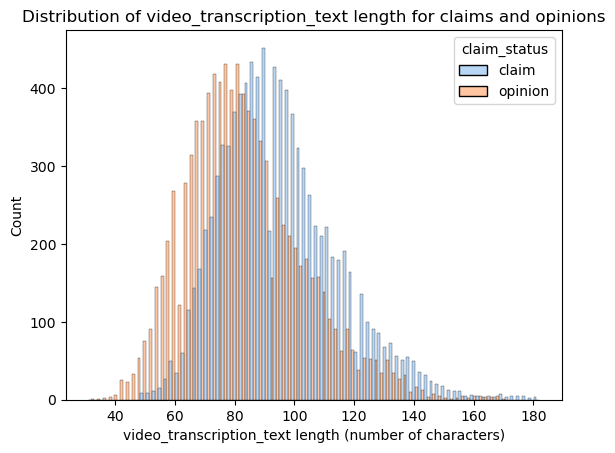
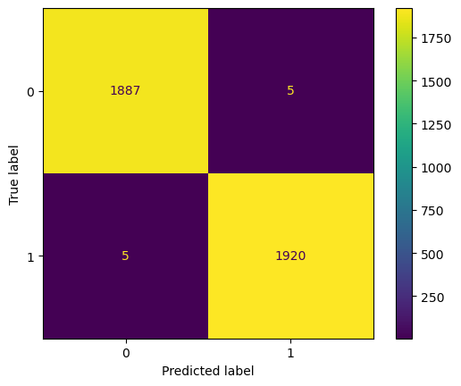
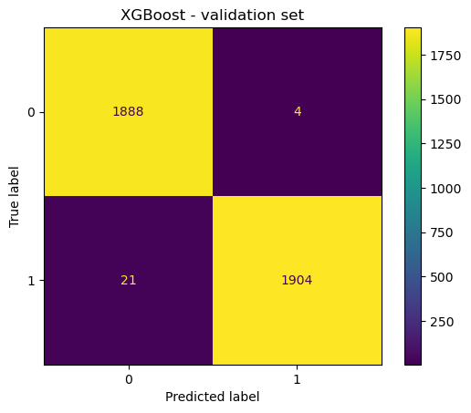
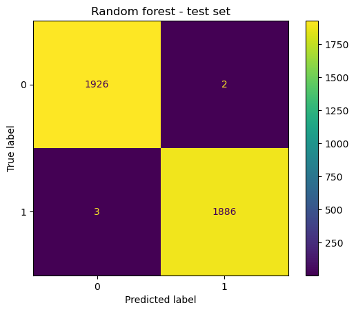
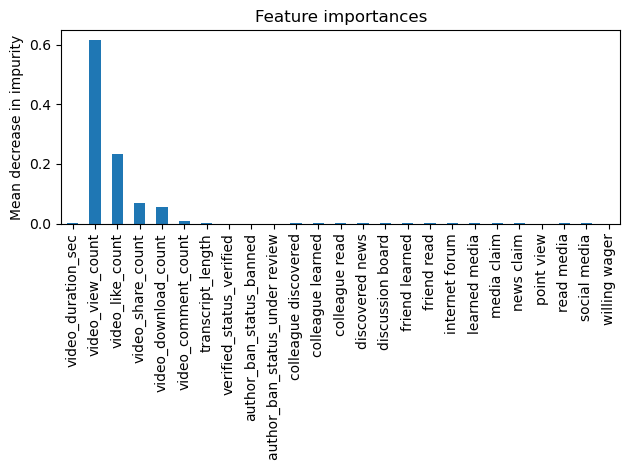

# **TikTok Project**
**Course 6 - The Nuts and bolts of machine learning**

Recall that you are a data professional at TikTok. Your supervisor was impressed with the work you have done and has requested that you build a machine learning model that can be used to determine whether a video contains a claim or whether it offers an opinion. With a successful prediction model, TikTok can reduce the backlog of user reports and prioritize them more efficiently.

A notebook was structured and prepared to help you in this project. A notebook was structured and prepared to help you in this project. Please complete the following questions.

# **Course 6 End-of-course project: Classifying videos using machine learning**

In this activity, you will practice using machine learning techniques to predict on a binary outcome variable.
<br/>

**The purpose** of this model is to increase response time and system efficiency by automating the initial stages of the claims process.

**The goal** of this model is to predict whether a TikTok video presents a "claim" or presents an "opinion".
<br/>

*This activity has three parts:*

**Part 1:** Ethical considerations
* Consider the ethical implications of the request

* Should the objective of the model be adjusted?

**Part 2:** Feature engineering

* Perform feature selection, extraction, and transformation to prepare the data for modeling

**Part 3:** Modeling

* Build the models, evaluate them, and advise on next steps

Follow the instructions and answer the questions below to complete the activity. Then, you will complete an Executive Summary using the questions listed on the PACE Strategy Document.

Be sure to complete this activity before moving on. The next course item will provide you with a completed exemplar to compare to your own work.


# **Classify videos using machine learning**


# **PACE stages**


Throughout these project notebooks, you'll see references to the problem-solving framework PACE. The following notebook components are labeled with the respective PACE stage: Plan, Analyze, Construct, and Execute.


## **PACE: Plan**

Consider the questions in your PACE Strategy Document to reflect on the Plan stage.

In this stage, consider the following questions:


1.   **What are you being asked to do? What metric should I use to evaluate success of my business/organizational objective?**

2.   **What are the ethical implications of the model? What are the consequences of your model making errors?**
  *   What is the likely effect of the model when it predicts a false negative (i.e., when the model says a video does not contain a claim and it actually does)?

  *   What is the likely effect of the model when it predicts a false positive (i.e., when the model says a video does contain a claim and it actually does not)?

3.   **How would you proceed?**


==> ENTER YOUR RESPONSES HERE

### **Task 1. Imports and data loading**

Start by importing packages needed to build machine learning models to achieve the goal of this project.


```python
# Import packages for data manipulation
import pandas as pd
import numpy as np

# Import packages for data visualization
import matplotlib.pyplot as plt
import seaborn as sns

# Import packages for data preprocessing
from sklearn.feature_extraction.text import CountVectorizer

# Import packages for data modeling
from sklearn.model_selection import train_test_split, GridSearchCV
from sklearn.metrics import classification_report, accuracy_score, precision_score, \
recall_score, f1_score, confusion_matrix, ConfusionMatrixDisplay

from sklearn.ensemble import RandomForestClassifier
from xgboost import XGBClassifier
from xgboost import plot_importance

```

Now load the data from the provided csv file into a dataframe.

**Note:** As shown in this cell, the dataset has been automatically loaded in for you. You do not need to download the .csv file, or provide more code, in order to access the dataset and proceed with this lab. Please continue with this activity by completing the following instructions.


```python
# Load dataset into dataframe
data = pd.read_csv("tiktok_dataset.csv")
```


## **PACE: Analyze**

Consider the questions in your PACE Strategy Document to reflect on the Analyze stage.

### **Task 2: Examine data, summary info, and descriptive stats**

Inspect the first five rows of the dataframe.


```python
# Display first few rows
data.head()

```


<div>
<style scoped>
    .dataframe tbody tr th:only-of-type {
        vertical-align: middle;
    }

    .dataframe tbody tr th {
        vertical-align: top;
    }

    .dataframe thead th {
        text-align: right;
    }
</style>
<table border="1" class="dataframe">
  <thead>
    <tr style="text-align: right;">
      <th></th>
      <th>#</th>
      <th>claim_status</th>
      <th>video_id</th>
      <th>video_duration_sec</th>
      <th>video_transcription_text</th>
      <th>verified_status</th>
      <th>author_ban_status</th>
      <th>video_view_count</th>
      <th>video_like_count</th>
      <th>video_share_count</th>
      <th>video_download_count</th>
      <th>video_comment_count</th>
    </tr>
  </thead>
  <tbody>
    <tr>
      <th>0</th>
      <td>1</td>
      <td>claim</td>
      <td>7017666017</td>
      <td>59</td>
      <td>someone shared with me that drone deliveries a...</td>
      <td>not verified</td>
      <td>under review</td>
      <td>343296.0</td>
      <td>19425.0</td>
      <td>241.0</td>
      <td>1.0</td>
      <td>0.0</td>
    </tr>
    <tr>
      <th>1</th>
      <td>2</td>
      <td>claim</td>
      <td>4014381136</td>
      <td>32</td>
      <td>someone shared with me that there are more mic...</td>
      <td>not verified</td>
      <td>active</td>
      <td>140877.0</td>
      <td>77355.0</td>
      <td>19034.0</td>
      <td>1161.0</td>
      <td>684.0</td>
    </tr>
    <tr>
      <th>2</th>
      <td>3</td>
      <td>claim</td>
      <td>9859838091</td>
      <td>31</td>
      <td>someone shared with me that american industria...</td>
      <td>not verified</td>
      <td>active</td>
      <td>902185.0</td>
      <td>97690.0</td>
      <td>2858.0</td>
      <td>833.0</td>
      <td>329.0</td>
    </tr>
    <tr>
      <th>3</th>
      <td>4</td>
      <td>claim</td>
      <td>1866847991</td>
      <td>25</td>
      <td>someone shared with me that the metro of st. p...</td>
      <td>not verified</td>
      <td>active</td>
      <td>437506.0</td>
      <td>239954.0</td>
      <td>34812.0</td>
      <td>1234.0</td>
      <td>584.0</td>
    </tr>
    <tr>
      <th>4</th>
      <td>5</td>
      <td>claim</td>
      <td>7105231098</td>
      <td>19</td>
      <td>someone shared with me that the number of busi...</td>
      <td>not verified</td>
      <td>active</td>
      <td>56167.0</td>
      <td>34987.0</td>
      <td>4110.0</td>
      <td>547.0</td>
      <td>152.0</td>
    </tr>
  </tbody>
</table>
</div>


Get the number of rows and columns in the dataset.


```python
# Get number of rows and columns
data.shape

```


    (19382, 12)


Get the data types of the columns.


```python
# Get data types of columns
data.dtypes
```


    #                             int64
    claim_status                 object
    video_id                      int64
    video_duration_sec            int64
    video_transcription_text     object
    verified_status              object
    author_ban_status            object
    video_view_count            float64
    video_like_count            float64
    video_share_count           float64
    video_download_count        float64
    video_comment_count         float64
    dtype: object


Get basic information about the dataset.


```python
# Get basic information
data.info()

```

    <class 'pandas.core.frame.DataFrame'>
    RangeIndex: 19382 entries, 0 to 19381
    Data columns (total 12 columns):
     #   Column                    Non-Null Count  Dtype  
    ---  ------                    --------------  -----  
     0   #                         19382 non-null  int64  
     1   claim_status              19084 non-null  object 
     2   video_id                  19382 non-null  int64  
     3   video_duration_sec        19382 non-null  int64  
     4   video_transcription_text  19084 non-null  object 
     5   verified_status           19382 non-null  object 
     6   author_ban_status         19382 non-null  object 
     7   video_view_count          19084 non-null  float64
     8   video_like_count          19084 non-null  float64
     9   video_share_count         19084 non-null  float64
     10  video_download_count      19084 non-null  float64
     11  video_comment_count       19084 non-null  float64
    dtypes: float64(5), int64(3), object(4)
    memory usage: 1.8+ MB


Generate basic descriptive statistics about the dataset.


```python
# Generate basic descriptive stats
data.describe()

```


<div>
<style scoped>
    .dataframe tbody tr th:only-of-type {
        vertical-align: middle;
    }

    .dataframe tbody tr th {
        vertical-align: top;
    }

    .dataframe thead th {
        text-align: right;
    }
</style>
<table border="1" class="dataframe">
  <thead>
    <tr style="text-align: right;">
      <th></th>
      <th>#</th>
      <th>video_id</th>
      <th>video_duration_sec</th>
      <th>video_view_count</th>
      <th>video_like_count</th>
      <th>video_share_count</th>
      <th>video_download_count</th>
      <th>video_comment_count</th>
    </tr>
  </thead>
  <tbody>
    <tr>
      <th>count</th>
      <td>19382.000000</td>
      <td>1.938200e+04</td>
      <td>19382.000000</td>
      <td>19084.000000</td>
      <td>19084.000000</td>
      <td>19084.000000</td>
      <td>19084.000000</td>
      <td>19084.000000</td>
    </tr>
    <tr>
      <th>mean</th>
      <td>9691.500000</td>
      <td>5.627454e+09</td>
      <td>32.421732</td>
      <td>254708.558688</td>
      <td>84304.636030</td>
      <td>16735.248323</td>
      <td>1049.429627</td>
      <td>349.312146</td>
    </tr>
    <tr>
      <th>std</th>
      <td>5595.245794</td>
      <td>2.536440e+09</td>
      <td>16.229967</td>
      <td>322893.280814</td>
      <td>133420.546814</td>
      <td>32036.174350</td>
      <td>2004.299894</td>
      <td>799.638865</td>
    </tr>
    <tr>
      <th>min</th>
      <td>1.000000</td>
      <td>1.234959e+09</td>
      <td>5.000000</td>
      <td>20.000000</td>
      <td>0.000000</td>
      <td>0.000000</td>
      <td>0.000000</td>
      <td>0.000000</td>
    </tr>
    <tr>
      <th>25%</th>
      <td>4846.250000</td>
      <td>3.430417e+09</td>
      <td>18.000000</td>
      <td>4942.500000</td>
      <td>810.750000</td>
      <td>115.000000</td>
      <td>7.000000</td>
      <td>1.000000</td>
    </tr>
    <tr>
      <th>50%</th>
      <td>9691.500000</td>
      <td>5.618664e+09</td>
      <td>32.000000</td>
      <td>9954.500000</td>
      <td>3403.500000</td>
      <td>717.000000</td>
      <td>46.000000</td>
      <td>9.000000</td>
    </tr>
    <tr>
      <th>75%</th>
      <td>14536.750000</td>
      <td>7.843960e+09</td>
      <td>47.000000</td>
      <td>504327.000000</td>
      <td>125020.000000</td>
      <td>18222.000000</td>
      <td>1156.250000</td>
      <td>292.000000</td>
    </tr>
    <tr>
      <th>max</th>
      <td>19382.000000</td>
      <td>9.999873e+09</td>
      <td>60.000000</td>
      <td>999817.000000</td>
      <td>657830.000000</td>
      <td>256130.000000</td>
      <td>14994.000000</td>
      <td>9599.000000</td>
    </tr>
  </tbody>
</table>
</div>


Check for and handle missing values.


```python
# Check for missing values
data.isna().sum()

```


    #                             0
    claim_status                298
    video_id                      0
    video_duration_sec            0
    video_transcription_text    298
    verified_status               0
    author_ban_status             0
    video_view_count            298
    video_like_count            298
    video_share_count           298
    video_download_count        298
    video_comment_count         298
    dtype: int64


```python
# Drop rows with missing values
data = data.dropna(axis=0)

```


```python

# Display first few rows after handling missing values
data.head()

```


<div>
<style scoped>
    .dataframe tbody tr th:only-of-type {
        vertical-align: middle;
    }

    .dataframe tbody tr th {
        vertical-align: top;
    }

    .dataframe thead th {
        text-align: right;
    }
</style>
<table border="1" class="dataframe">
  <thead>
    <tr style="text-align: right;">
      <th></th>
      <th>#</th>
      <th>claim_status</th>
      <th>video_id</th>
      <th>video_duration_sec</th>
      <th>video_transcription_text</th>
      <th>verified_status</th>
      <th>author_ban_status</th>
      <th>video_view_count</th>
      <th>video_like_count</th>
      <th>video_share_count</th>
      <th>video_download_count</th>
      <th>video_comment_count</th>
    </tr>
  </thead>
  <tbody>
    <tr>
      <th>0</th>
      <td>1</td>
      <td>claim</td>
      <td>7017666017</td>
      <td>59</td>
      <td>someone shared with me that drone deliveries a...</td>
      <td>not verified</td>
      <td>under review</td>
      <td>343296.0</td>
      <td>19425.0</td>
      <td>241.0</td>
      <td>1.0</td>
      <td>0.0</td>
    </tr>
    <tr>
      <th>1</th>
      <td>2</td>
      <td>claim</td>
      <td>4014381136</td>
      <td>32</td>
      <td>someone shared with me that there are more mic...</td>
      <td>not verified</td>
      <td>active</td>
      <td>140877.0</td>
      <td>77355.0</td>
      <td>19034.0</td>
      <td>1161.0</td>
      <td>684.0</td>
    </tr>
    <tr>
      <th>2</th>
      <td>3</td>
      <td>claim</td>
      <td>9859838091</td>
      <td>31</td>
      <td>someone shared with me that american industria...</td>
      <td>not verified</td>
      <td>active</td>
      <td>902185.0</td>
      <td>97690.0</td>
      <td>2858.0</td>
      <td>833.0</td>
      <td>329.0</td>
    </tr>
    <tr>
      <th>3</th>
      <td>4</td>
      <td>claim</td>
      <td>1866847991</td>
      <td>25</td>
      <td>someone shared with me that the metro of st. p...</td>
      <td>not verified</td>
      <td>active</td>
      <td>437506.0</td>
      <td>239954.0</td>
      <td>34812.0</td>
      <td>1234.0</td>
      <td>584.0</td>
    </tr>
    <tr>
      <th>4</th>
      <td>5</td>
      <td>claim</td>
      <td>7105231098</td>
      <td>19</td>
      <td>someone shared with me that the number of busi...</td>
      <td>not verified</td>
      <td>active</td>
      <td>56167.0</td>
      <td>34987.0</td>
      <td>4110.0</td>
      <td>547.0</td>
      <td>152.0</td>
    </tr>
  </tbody>
</table>
</div>


Check for and handle duplicates.


```python
# Check for duplicates
data.duplicated().sum()

```


    0


Check for and handle outliers.


```python
#handling outliers are not needed as they will be standardized data 

```

Check class balance.


```python
# Check class balance
data['claim_status'].value_counts(normalize=True)

```


    claim_status
    claim      0.503458
    opinion    0.496542
    Name: proportion, dtype: float64


## **PACE: Construct**
Consider the questions in your PACE Strategy Document to reflect on the Construct stage.

### **Task 3: Feature engineering**

Extract the length of each `video_transcription_text` and add this as a column to the dataframe, so that it can be used as a potential feature in the model.


```python
# Extract the length of each `video_transcription_text` and add this as a column to the dataframe
data['transcript_length'] = data['video_transcription_text'].str.len()

```

Calculate the average text_length for claims and opinions.


```python
# Display first few rows of dataframe after adding new column
data.head()

```


<div>
<style scoped>
    .dataframe tbody tr th:only-of-type {
        vertical-align: middle;
    }

    .dataframe tbody tr th {
        vertical-align: top;
    }

    .dataframe thead th {
        text-align: right;
    }
</style>
<table border="1" class="dataframe">
  <thead>
    <tr style="text-align: right;">
      <th></th>
      <th>#</th>
      <th>claim_status</th>
      <th>video_id</th>
      <th>video_duration_sec</th>
      <th>video_transcription_text</th>
      <th>verified_status</th>
      <th>author_ban_status</th>
      <th>video_view_count</th>
      <th>video_like_count</th>
      <th>video_share_count</th>
      <th>video_download_count</th>
      <th>video_comment_count</th>
      <th>transcript_length</th>
    </tr>
  </thead>
  <tbody>
    <tr>
      <th>0</th>
      <td>1</td>
      <td>claim</td>
      <td>7017666017</td>
      <td>59</td>
      <td>someone shared with me that drone deliveries a...</td>
      <td>not verified</td>
      <td>under review</td>
      <td>343296.0</td>
      <td>19425.0</td>
      <td>241.0</td>
      <td>1.0</td>
      <td>0.0</td>
      <td>97</td>
    </tr>
    <tr>
      <th>1</th>
      <td>2</td>
      <td>claim</td>
      <td>4014381136</td>
      <td>32</td>
      <td>someone shared with me that there are more mic...</td>
      <td>not verified</td>
      <td>active</td>
      <td>140877.0</td>
      <td>77355.0</td>
      <td>19034.0</td>
      <td>1161.0</td>
      <td>684.0</td>
      <td>107</td>
    </tr>
    <tr>
      <th>2</th>
      <td>3</td>
      <td>claim</td>
      <td>9859838091</td>
      <td>31</td>
      <td>someone shared with me that american industria...</td>
      <td>not verified</td>
      <td>active</td>
      <td>902185.0</td>
      <td>97690.0</td>
      <td>2858.0</td>
      <td>833.0</td>
      <td>329.0</td>
      <td>137</td>
    </tr>
    <tr>
      <th>3</th>
      <td>4</td>
      <td>claim</td>
      <td>1866847991</td>
      <td>25</td>
      <td>someone shared with me that the metro of st. p...</td>
      <td>not verified</td>
      <td>active</td>
      <td>437506.0</td>
      <td>239954.0</td>
      <td>34812.0</td>
      <td>1234.0</td>
      <td>584.0</td>
      <td>131</td>
    </tr>
    <tr>
      <th>4</th>
      <td>5</td>
      <td>claim</td>
      <td>7105231098</td>
      <td>19</td>
      <td>someone shared with me that the number of busi...</td>
      <td>not verified</td>
      <td>active</td>
      <td>56167.0</td>
      <td>34987.0</td>
      <td>4110.0</td>
      <td>547.0</td>
      <td>152.0</td>
      <td>128</td>
    </tr>
  </tbody>
</table>
</div>


Visualize the distribution of `video_transcription_text` length for claims and opinions.


```python
# Visualize the distribution of `video_transcription_text` length for claims and opinions
# Create two histograms in one plot

sns.histplot(data=data, stat='count', multiple='dodge', x='transcript_length', kde =False, palette="pastel", hue="claim_status",
             element="bars", legend=True)
plt.xlabel("video_transcription_text length (number of characters)")
plt.ylabel("Count")
plt.title("Distribution of video_transcription_text length for claims and opinions")
plt.show()

```


    

    


Create a heatmap to visualize how correlated variables are. Consider which variables you're interested in examining correlations between.


```python
# Create a heatmap to visualize how correlated variables are
hm = data.groupby('claim_status').transcript_length.value_counts().unstack().fillna(0)

sns.heatmap(hm)

```


    <Axes: xlabel='transcript_length', ylabel='claim_status'>


    

    


One of the model assumptions for logistic regression is no severe multicollinearity among the features. Take this into consideration as you examine the heatmap and choose which features to proceed with.


## **PACE: Construct**
Consider the questions in your PACE Strategy Document to reflect on the Construct stage.

### **Task 3. Feature engineering**

Select the outcome variable.


```python
# Select outcome variable
X = data.copy()
X = X.drop(['#', 'video_id'], axis=1)
X['claim_status'] = X['claim_status'].replace({'opinion': 0, 'claim': 1})
X = pd.get_dummies(X, columns = ['verified_status', 'author_ban_status'],drop_first=True)
```

**Feature selection and transformation**

Encode target and catgorical variables.


```python
### YOUR CODE HERE ###

# Display first few rows
X.head()

```


<div>
<style scoped>
    .dataframe tbody tr th:only-of-type {
        vertical-align: middle;
    }

    .dataframe tbody tr th {
        vertical-align: top;
    }

    .dataframe thead th {
        text-align: right;
    }
</style>
<table border="1" class="dataframe">
  <thead>
    <tr style="text-align: right;">
      <th></th>
      <th>claim_status</th>
      <th>video_duration_sec</th>
      <th>video_transcription_text</th>
      <th>video_view_count</th>
      <th>video_like_count</th>
      <th>video_share_count</th>
      <th>video_download_count</th>
      <th>video_comment_count</th>
      <th>transcript_length</th>
      <th>verified_status_verified</th>
      <th>author_ban_status_banned</th>
      <th>author_ban_status_under review</th>
    </tr>
  </thead>
  <tbody>
    <tr>
      <th>0</th>
      <td>1</td>
      <td>59</td>
      <td>someone shared with me that drone deliveries a...</td>
      <td>343296.0</td>
      <td>19425.0</td>
      <td>241.0</td>
      <td>1.0</td>
      <td>0.0</td>
      <td>97</td>
      <td>False</td>
      <td>False</td>
      <td>True</td>
    </tr>
    <tr>
      <th>1</th>
      <td>1</td>
      <td>32</td>
      <td>someone shared with me that there are more mic...</td>
      <td>140877.0</td>
      <td>77355.0</td>
      <td>19034.0</td>
      <td>1161.0</td>
      <td>684.0</td>
      <td>107</td>
      <td>False</td>
      <td>False</td>
      <td>False</td>
    </tr>
    <tr>
      <th>2</th>
      <td>1</td>
      <td>31</td>
      <td>someone shared with me that american industria...</td>
      <td>902185.0</td>
      <td>97690.0</td>
      <td>2858.0</td>
      <td>833.0</td>
      <td>329.0</td>
      <td>137</td>
      <td>False</td>
      <td>False</td>
      <td>False</td>
    </tr>
    <tr>
      <th>3</th>
      <td>1</td>
      <td>25</td>
      <td>someone shared with me that the metro of st. p...</td>
      <td>437506.0</td>
      <td>239954.0</td>
      <td>34812.0</td>
      <td>1234.0</td>
      <td>584.0</td>
      <td>131</td>
      <td>False</td>
      <td>False</td>
      <td>False</td>
    </tr>
    <tr>
      <th>4</th>
      <td>1</td>
      <td>19</td>
      <td>someone shared with me that the number of busi...</td>
      <td>56167.0</td>
      <td>34987.0</td>
      <td>4110.0</td>
      <td>547.0</td>
      <td>152.0</td>
      <td>128</td>
      <td>False</td>
      <td>False</td>
      <td>False</td>
    </tr>
  </tbody>
</table>
</div>


### **Task 4. Split the data**


Assign target variable.

Isolate the features.


```python
y = X['claim_status']
```


```python
#Isolate features
X = X.drop(['claim_status'], axis=1)

# Display first few rows of features dataframe
X.head()

```


<div>
<style scoped>
    .dataframe tbody tr th:only-of-type {
        vertical-align: middle;
    }

    .dataframe tbody tr th {
        vertical-align: top;
    }

    .dataframe thead th {
        text-align: right;
    }
</style>
<table border="1" class="dataframe">
  <thead>
    <tr style="text-align: right;">
      <th></th>
      <th>video_duration_sec</th>
      <th>video_transcription_text</th>
      <th>video_view_count</th>
      <th>video_like_count</th>
      <th>video_share_count</th>
      <th>video_download_count</th>
      <th>video_comment_count</th>
      <th>transcript_length</th>
      <th>verified_status_verified</th>
      <th>author_ban_status_banned</th>
      <th>author_ban_status_under review</th>
    </tr>
  </thead>
  <tbody>
    <tr>
      <th>0</th>
      <td>59</td>
      <td>someone shared with me that drone deliveries a...</td>
      <td>343296.0</td>
      <td>19425.0</td>
      <td>241.0</td>
      <td>1.0</td>
      <td>0.0</td>
      <td>97</td>
      <td>False</td>
      <td>False</td>
      <td>True</td>
    </tr>
    <tr>
      <th>1</th>
      <td>32</td>
      <td>someone shared with me that there are more mic...</td>
      <td>140877.0</td>
      <td>77355.0</td>
      <td>19034.0</td>
      <td>1161.0</td>
      <td>684.0</td>
      <td>107</td>
      <td>False</td>
      <td>False</td>
      <td>False</td>
    </tr>
    <tr>
      <th>2</th>
      <td>31</td>
      <td>someone shared with me that american industria...</td>
      <td>902185.0</td>
      <td>97690.0</td>
      <td>2858.0</td>
      <td>833.0</td>
      <td>329.0</td>
      <td>137</td>
      <td>False</td>
      <td>False</td>
      <td>False</td>
    </tr>
    <tr>
      <th>3</th>
      <td>25</td>
      <td>someone shared with me that the metro of st. p...</td>
      <td>437506.0</td>
      <td>239954.0</td>
      <td>34812.0</td>
      <td>1234.0</td>
      <td>584.0</td>
      <td>131</td>
      <td>False</td>
      <td>False</td>
      <td>False</td>
    </tr>
    <tr>
      <th>4</th>
      <td>19</td>
      <td>someone shared with me that the number of busi...</td>
      <td>56167.0</td>
      <td>34987.0</td>
      <td>4110.0</td>
      <td>547.0</td>
      <td>152.0</td>
      <td>128</td>
      <td>False</td>
      <td>False</td>
      <td>False</td>
    </tr>
  </tbody>
</table>
</div>


```python

```

#### **Task 5: Create train/validate/test sets**

Split data into training and testing sets, 80/20.


```python
X_tr, X_test, y_tr, y_test = train_test_split(X, y, test_size=0.2, random_state=0)
```

Split the training set into training and validation sets, 75/25, to result in a final ratio of 60/20/20 for train/validate/test sets.


```python
X_train, X_val, y_train, y_val = train_test_split(X_tr, y_tr, test_size=0.25, random_state=0)
```

Confirm that the dimensions of the training, validation, and testing sets are in alignment.


```python
X_train.shape, X_val.shape, X_test.shape, y_train.shape, y_val.shape, y_test.shape
```


    ((11450, 11), (3817, 11), (3817, 11), (11450,), (3817,), (3817,))


```python
# Set up a `CountVectorizer` object, which converts a collection of text to a matrix of token counts
count_vec = CountVectorizer(ngram_range=(2, 3),
                            max_features=15,
                            stop_words='english')
count_vec
```


<style>#sk-container-id-1 {color: black;background-color: white;}#sk-container-id-1 pre{padding: 0;}#sk-container-id-1 div.sk-toggleable {background-color: white;}#sk-container-id-1 label.sk-toggleable__label {cursor: pointer;display: block;width: 100%;margin-bottom: 0;padding: 0.3em;box-sizing: border-box;text-align: center;}#sk-container-id-1 label.sk-toggleable__label-arrow:before {content: "▸";float: left;margin-right: 0.25em;color: #696969;}#sk-container-id-1 label.sk-toggleable__label-arrow:hover:before {color: black;}#sk-container-id-1 div.sk-estimator:hover label.sk-toggleable__label-arrow:before {color: black;}#sk-container-id-1 div.sk-toggleable__content {max-height: 0;max-width: 0;overflow: hidden;text-align: left;background-color: #f0f8ff;}#sk-container-id-1 div.sk-toggleable__content pre {margin: 0.2em;color: black;border-radius: 0.25em;background-color: #f0f8ff;}#sk-container-id-1 input.sk-toggleable__control:checked~div.sk-toggleable__content {max-height: 200px;max-width: 100%;overflow: auto;}#sk-container-id-1 input.sk-toggleable__control:checked~label.sk-toggleable__label-arrow:before {content: "▾";}#sk-container-id-1 div.sk-estimator input.sk-toggleable__control:checked~label.sk-toggleable__label {background-color: #d4ebff;}#sk-container-id-1 div.sk-label input.sk-toggleable__control:checked~label.sk-toggleable__label {background-color: #d4ebff;}#sk-container-id-1 input.sk-hidden--visually {border: 0;clip: rect(1px 1px 1px 1px);clip: rect(1px, 1px, 1px, 1px);height: 1px;margin: -1px;overflow: hidden;padding: 0;position: absolute;width: 1px;}#sk-container-id-1 div.sk-estimator {font-family: monospace;background-color: #f0f8ff;border: 1px dotted black;border-radius: 0.25em;box-sizing: border-box;margin-bottom: 0.5em;}#sk-container-id-1 div.sk-estimator:hover {background-color: #d4ebff;}#sk-container-id-1 div.sk-parallel-item::after {content: "";width: 100%;border-bottom: 1px solid gray;flex-grow: 1;}#sk-container-id-1 div.sk-label:hover label.sk-toggleable__label {background-color: #d4ebff;}#sk-container-id-1 div.sk-serial::before {content: "";position: absolute;border-left: 1px solid gray;box-sizing: border-box;top: 0;bottom: 0;left: 50%;z-index: 0;}#sk-container-id-1 div.sk-serial {display: flex;flex-direction: column;align-items: center;background-color: white;padding-right: 0.2em;padding-left: 0.2em;position: relative;}#sk-container-id-1 div.sk-item {position: relative;z-index: 1;}#sk-container-id-1 div.sk-parallel {display: flex;align-items: stretch;justify-content: center;background-color: white;position: relative;}#sk-container-id-1 div.sk-item::before, #sk-container-id-1 div.sk-parallel-item::before {content: "";position: absolute;border-left: 1px solid gray;box-sizing: border-box;top: 0;bottom: 0;left: 50%;z-index: -1;}#sk-container-id-1 div.sk-parallel-item {display: flex;flex-direction: column;z-index: 1;position: relative;background-color: white;}#sk-container-id-1 div.sk-parallel-item:first-child::after {align-self: flex-end;width: 50%;}#sk-container-id-1 div.sk-parallel-item:last-child::after {align-self: flex-start;width: 50%;}#sk-container-id-1 div.sk-parallel-item:only-child::after {width: 0;}#sk-container-id-1 div.sk-dashed-wrapped {border: 1px dashed gray;margin: 0 0.4em 0.5em 0.4em;box-sizing: border-box;padding-bottom: 0.4em;background-color: white;}#sk-container-id-1 div.sk-label label {font-family: monospace;font-weight: bold;display: inline-block;line-height: 1.2em;}#sk-container-id-1 div.sk-label-container {text-align: center;}#sk-container-id-1 div.sk-container {/* jupyter's `normalize.less` sets `[hidden] { display: none; }` but bootstrap.min.css set `[hidden] { display: none !important; }` so we also need the `!important` here to be able to override the default hidden behavior on the sphinx rendered scikit-learn.org. See: https://github.com/scikit-learn/scikit-learn/issues/21755 */display: inline-block !important;position: relative;}#sk-container-id-1 div.sk-text-repr-fallback {display: none;}</style><div id="sk-container-id-1" class="sk-top-container"><div class="sk-text-repr-fallback"><pre>CountVectorizer(max_features=15, ngram_range=(2, 3), stop_words=&#x27;english&#x27;)</pre><b>In a Jupyter environment, please rerun this cell to show the HTML representation or trust the notebook. <br />On GitHub, the HTML representation is unable to render, please try loading this page with nbviewer.org.</b></div><div class="sk-container" hidden><div class="sk-item"><div class="sk-estimator sk-toggleable"><input class="sk-toggleable__control sk-hidden--visually" id="sk-estimator-id-1" type="checkbox" checked><label for="sk-estimator-id-1" class="sk-toggleable__label sk-toggleable__label-arrow">CountVectorizer</label><div class="sk-toggleable__content"><pre>CountVectorizer(max_features=15, ngram_range=(2, 3), stop_words=&#x27;english&#x27;)</pre></div></div></div></div></div>


```python
# Extract numerical features from `video_transcription_text` in the training set
count_data = count_vec.fit_transform(X_train['video_transcription_text']).toarray()
count_data
```


    array([[0, 0, 0, ..., 0, 0, 0],
           [0, 0, 0, ..., 0, 0, 0],
           [0, 0, 0, ..., 0, 0, 0],
           ...,
           [0, 0, 1, ..., 1, 0, 0],
           [0, 0, 0, ..., 0, 0, 0],
           [0, 0, 0, ..., 0, 0, 0]])


```python
# Place the numerical representation of `video_transcription_text` from training set into a dataframe
count_df = pd.DataFrame(data=count_data, columns=count_vec.get_feature_names_out())

# Display first few rows
count_df.head()
```


<div>
<style scoped>
    .dataframe tbody tr th:only-of-type {
        vertical-align: middle;
    }

    .dataframe tbody tr th {
        vertical-align: top;
    }

    .dataframe thead th {
        text-align: right;
    }
</style>
<table border="1" class="dataframe">
  <thead>
    <tr style="text-align: right;">
      <th></th>
      <th>colleague discovered</th>
      <th>colleague learned</th>
      <th>colleague read</th>
      <th>discovered news</th>
      <th>discussion board</th>
      <th>friend learned</th>
      <th>friend read</th>
      <th>internet forum</th>
      <th>learned media</th>
      <th>media claim</th>
      <th>news claim</th>
      <th>point view</th>
      <th>read media</th>
      <th>social media</th>
      <th>willing wager</th>
    </tr>
  </thead>
  <tbody>
    <tr>
      <th>0</th>
      <td>0</td>
      <td>0</td>
      <td>0</td>
      <td>0</td>
      <td>0</td>
      <td>0</td>
      <td>0</td>
      <td>0</td>
      <td>0</td>
      <td>0</td>
      <td>0</td>
      <td>0</td>
      <td>0</td>
      <td>0</td>
      <td>0</td>
    </tr>
    <tr>
      <th>1</th>
      <td>0</td>
      <td>0</td>
      <td>0</td>
      <td>0</td>
      <td>0</td>
      <td>0</td>
      <td>1</td>
      <td>0</td>
      <td>0</td>
      <td>0</td>
      <td>0</td>
      <td>0</td>
      <td>0</td>
      <td>0</td>
      <td>0</td>
    </tr>
    <tr>
      <th>2</th>
      <td>0</td>
      <td>0</td>
      <td>0</td>
      <td>0</td>
      <td>0</td>
      <td>0</td>
      <td>1</td>
      <td>0</td>
      <td>0</td>
      <td>0</td>
      <td>0</td>
      <td>0</td>
      <td>0</td>
      <td>0</td>
      <td>0</td>
    </tr>
    <tr>
      <th>3</th>
      <td>0</td>
      <td>0</td>
      <td>0</td>
      <td>0</td>
      <td>0</td>
      <td>0</td>
      <td>0</td>
      <td>0</td>
      <td>0</td>
      <td>0</td>
      <td>0</td>
      <td>0</td>
      <td>0</td>
      <td>0</td>
      <td>0</td>
    </tr>
    <tr>
      <th>4</th>
      <td>0</td>
      <td>0</td>
      <td>0</td>
      <td>0</td>
      <td>0</td>
      <td>0</td>
      <td>0</td>
      <td>0</td>
      <td>0</td>
      <td>0</td>
      <td>0</td>
      <td>0</td>
      <td>0</td>
      <td>0</td>
      <td>0</td>
    </tr>
  </tbody>
</table>
</div>


```python
# Concatenate `X_train` and `count_df` to form the final dataframe for training data (`X_train_final`)
# Note: Using `.reset_index(drop=True)` to reset the index in X_train after dropping `video_transcription_text`,
# so that the indices align with those in `X_train` and `count_df`
X_train_final = pd.concat([X_train.drop(columns=['video_transcription_text']).reset_index(drop=True), count_df], axis=1)

# Display first few rows
X_train_final.head()
```


<div>
<style scoped>
    .dataframe tbody tr th:only-of-type {
        vertical-align: middle;
    }

    .dataframe tbody tr th {
        vertical-align: top;
    }

    .dataframe thead th {
        text-align: right;
    }
</style>
<table border="1" class="dataframe">
  <thead>
    <tr style="text-align: right;">
      <th></th>
      <th>video_duration_sec</th>
      <th>video_view_count</th>
      <th>video_like_count</th>
      <th>video_share_count</th>
      <th>video_download_count</th>
      <th>video_comment_count</th>
      <th>transcript_length</th>
      <th>verified_status_verified</th>
      <th>author_ban_status_banned</th>
      <th>author_ban_status_under review</th>
      <th>...</th>
      <th>friend learned</th>
      <th>friend read</th>
      <th>internet forum</th>
      <th>learned media</th>
      <th>media claim</th>
      <th>news claim</th>
      <th>point view</th>
      <th>read media</th>
      <th>social media</th>
      <th>willing wager</th>
    </tr>
  </thead>
  <tbody>
    <tr>
      <th>0</th>
      <td>51</td>
      <td>2487.0</td>
      <td>310.0</td>
      <td>20.0</td>
      <td>1.0</td>
      <td>0.0</td>
      <td>134</td>
      <td>False</td>
      <td>False</td>
      <td>False</td>
      <td>...</td>
      <td>0</td>
      <td>0</td>
      <td>0</td>
      <td>0</td>
      <td>0</td>
      <td>0</td>
      <td>0</td>
      <td>0</td>
      <td>0</td>
      <td>0</td>
    </tr>
    <tr>
      <th>1</th>
      <td>43</td>
      <td>118512.0</td>
      <td>3543.0</td>
      <td>374.0</td>
      <td>70.0</td>
      <td>29.0</td>
      <td>97</td>
      <td>False</td>
      <td>True</td>
      <td>False</td>
      <td>...</td>
      <td>0</td>
      <td>1</td>
      <td>0</td>
      <td>0</td>
      <td>0</td>
      <td>0</td>
      <td>0</td>
      <td>0</td>
      <td>0</td>
      <td>0</td>
    </tr>
    <tr>
      <th>2</th>
      <td>22</td>
      <td>105902.0</td>
      <td>1885.0</td>
      <td>229.0</td>
      <td>39.0</td>
      <td>9.0</td>
      <td>76</td>
      <td>False</td>
      <td>False</td>
      <td>True</td>
      <td>...</td>
      <td>0</td>
      <td>1</td>
      <td>0</td>
      <td>0</td>
      <td>0</td>
      <td>0</td>
      <td>0</td>
      <td>0</td>
      <td>0</td>
      <td>0</td>
    </tr>
    <tr>
      <th>3</th>
      <td>17</td>
      <td>9245.0</td>
      <td>1670.0</td>
      <td>440.0</td>
      <td>13.0</td>
      <td>4.0</td>
      <td>58</td>
      <td>False</td>
      <td>False</td>
      <td>False</td>
      <td>...</td>
      <td>0</td>
      <td>0</td>
      <td>0</td>
      <td>0</td>
      <td>0</td>
      <td>0</td>
      <td>0</td>
      <td>0</td>
      <td>0</td>
      <td>0</td>
    </tr>
    <tr>
      <th>4</th>
      <td>18</td>
      <td>3791.0</td>
      <td>660.0</td>
      <td>63.0</td>
      <td>9.0</td>
      <td>1.0</td>
      <td>57</td>
      <td>False</td>
      <td>False</td>
      <td>False</td>
      <td>...</td>
      <td>0</td>
      <td>0</td>
      <td>0</td>
      <td>0</td>
      <td>0</td>
      <td>0</td>
      <td>0</td>
      <td>0</td>
      <td>0</td>
      <td>0</td>
    </tr>
  </tbody>
</table>
<p>5 rows × 25 columns</p>
</div>


```python
# Extract numerical features from `video_transcription_text` in the testing set
validation_count_data = count_vec.transform(X_val['video_transcription_text']).toarray()
validation_count_data
```


    array([[0, 0, 0, ..., 1, 0, 0],
           [0, 0, 0, ..., 0, 0, 0],
           [0, 0, 0, ..., 1, 0, 0],
           ...,
           [0, 0, 0, ..., 0, 0, 0],
           [0, 1, 0, ..., 0, 0, 0],
           [0, 0, 0, ..., 0, 0, 0]])


```python
# Place the numerical representation of `video_transcription_text` from validation set into a dataframe
validation_count_df = pd.DataFrame(data=validation_count_data, columns=count_vec.get_feature_names_out())
validation_count_df.head()
```


<div>
<style scoped>
    .dataframe tbody tr th:only-of-type {
        vertical-align: middle;
    }

    .dataframe tbody tr th {
        vertical-align: top;
    }

    .dataframe thead th {
        text-align: right;
    }
</style>
<table border="1" class="dataframe">
  <thead>
    <tr style="text-align: right;">
      <th></th>
      <th>colleague discovered</th>
      <th>colleague learned</th>
      <th>colleague read</th>
      <th>discovered news</th>
      <th>discussion board</th>
      <th>friend learned</th>
      <th>friend read</th>
      <th>internet forum</th>
      <th>learned media</th>
      <th>media claim</th>
      <th>news claim</th>
      <th>point view</th>
      <th>read media</th>
      <th>social media</th>
      <th>willing wager</th>
    </tr>
  </thead>
  <tbody>
    <tr>
      <th>0</th>
      <td>0</td>
      <td>0</td>
      <td>0</td>
      <td>0</td>
      <td>0</td>
      <td>0</td>
      <td>0</td>
      <td>0</td>
      <td>0</td>
      <td>0</td>
      <td>0</td>
      <td>0</td>
      <td>1</td>
      <td>0</td>
      <td>0</td>
    </tr>
    <tr>
      <th>1</th>
      <td>0</td>
      <td>0</td>
      <td>0</td>
      <td>0</td>
      <td>0</td>
      <td>0</td>
      <td>0</td>
      <td>0</td>
      <td>0</td>
      <td>0</td>
      <td>0</td>
      <td>0</td>
      <td>0</td>
      <td>0</td>
      <td>0</td>
    </tr>
    <tr>
      <th>2</th>
      <td>0</td>
      <td>0</td>
      <td>0</td>
      <td>0</td>
      <td>0</td>
      <td>0</td>
      <td>1</td>
      <td>0</td>
      <td>0</td>
      <td>0</td>
      <td>0</td>
      <td>0</td>
      <td>1</td>
      <td>0</td>
      <td>0</td>
    </tr>
    <tr>
      <th>3</th>
      <td>0</td>
      <td>0</td>
      <td>0</td>
      <td>0</td>
      <td>0</td>
      <td>0</td>
      <td>0</td>
      <td>0</td>
      <td>0</td>
      <td>0</td>
      <td>0</td>
      <td>0</td>
      <td>0</td>
      <td>0</td>
      <td>0</td>
    </tr>
    <tr>
      <th>4</th>
      <td>0</td>
      <td>0</td>
      <td>1</td>
      <td>0</td>
      <td>0</td>
      <td>0</td>
      <td>0</td>
      <td>0</td>
      <td>0</td>
      <td>0</td>
      <td>0</td>
      <td>0</td>
      <td>1</td>
      <td>0</td>
      <td>0</td>
    </tr>
  </tbody>
</table>
</div>


```python
# Concatenate `X_val` and `validation_count_df` to form the final dataframe for training data (`X_val_final`)
# Note: Using `.reset_index(drop=True)` to reset the index in X_val after dropping `video_transcription_text`,
# so that the indices align with those in `validation_count_df`
X_val_final = pd.concat([X_val.drop(columns=['video_transcription_text']).reset_index(drop=True), validation_count_df], axis=1)

# Display first few rows
X_val_final.head()
```


<div>
<style scoped>
    .dataframe tbody tr th:only-of-type {
        vertical-align: middle;
    }

    .dataframe tbody tr th {
        vertical-align: top;
    }

    .dataframe thead th {
        text-align: right;
    }
</style>
<table border="1" class="dataframe">
  <thead>
    <tr style="text-align: right;">
      <th></th>
      <th>video_duration_sec</th>
      <th>video_view_count</th>
      <th>video_like_count</th>
      <th>video_share_count</th>
      <th>video_download_count</th>
      <th>video_comment_count</th>
      <th>transcript_length</th>
      <th>verified_status_verified</th>
      <th>author_ban_status_banned</th>
      <th>author_ban_status_under review</th>
      <th>...</th>
      <th>friend learned</th>
      <th>friend read</th>
      <th>internet forum</th>
      <th>learned media</th>
      <th>media claim</th>
      <th>news claim</th>
      <th>point view</th>
      <th>read media</th>
      <th>social media</th>
      <th>willing wager</th>
    </tr>
  </thead>
  <tbody>
    <tr>
      <th>0</th>
      <td>11</td>
      <td>578891.0</td>
      <td>379596.0</td>
      <td>14612.0</td>
      <td>6591.0</td>
      <td>44.0</td>
      <td>72</td>
      <td>False</td>
      <td>False</td>
      <td>True</td>
      <td>...</td>
      <td>0</td>
      <td>0</td>
      <td>0</td>
      <td>0</td>
      <td>0</td>
      <td>0</td>
      <td>0</td>
      <td>1</td>
      <td>0</td>
      <td>0</td>
    </tr>
    <tr>
      <th>1</th>
      <td>24</td>
      <td>6255.0</td>
      <td>1709.0</td>
      <td>311.0</td>
      <td>13.0</td>
      <td>1.0</td>
      <td>96</td>
      <td>False</td>
      <td>False</td>
      <td>False</td>
      <td>...</td>
      <td>0</td>
      <td>0</td>
      <td>0</td>
      <td>0</td>
      <td>0</td>
      <td>0</td>
      <td>0</td>
      <td>0</td>
      <td>0</td>
      <td>0</td>
    </tr>
    <tr>
      <th>2</th>
      <td>35</td>
      <td>410356.0</td>
      <td>249714.0</td>
      <td>26235.0</td>
      <td>2060.0</td>
      <td>1252.0</td>
      <td>88</td>
      <td>False</td>
      <td>False</td>
      <td>False</td>
      <td>...</td>
      <td>0</td>
      <td>1</td>
      <td>0</td>
      <td>0</td>
      <td>0</td>
      <td>0</td>
      <td>0</td>
      <td>1</td>
      <td>0</td>
      <td>0</td>
    </tr>
    <tr>
      <th>3</th>
      <td>58</td>
      <td>406911.0</td>
      <td>25986.0</td>
      <td>1230.0</td>
      <td>564.0</td>
      <td>248.0</td>
      <td>83</td>
      <td>False</td>
      <td>False</td>
      <td>False</td>
      <td>...</td>
      <td>0</td>
      <td>0</td>
      <td>0</td>
      <td>0</td>
      <td>0</td>
      <td>0</td>
      <td>0</td>
      <td>0</td>
      <td>0</td>
      <td>0</td>
    </tr>
    <tr>
      <th>4</th>
      <td>47</td>
      <td>972573.0</td>
      <td>138167.0</td>
      <td>25320.0</td>
      <td>3331.0</td>
      <td>968.0</td>
      <td>104</td>
      <td>False</td>
      <td>False</td>
      <td>True</td>
      <td>...</td>
      <td>0</td>
      <td>0</td>
      <td>0</td>
      <td>0</td>
      <td>0</td>
      <td>0</td>
      <td>0</td>
      <td>1</td>
      <td>0</td>
      <td>0</td>
    </tr>
  </tbody>
</table>
<p>5 rows × 25 columns</p>
</div>


```python
# Extract numerical features from `video_transcription_text` in the testing set
test_count_data = count_vec.transform(X_test['video_transcription_text']).toarray()

# Place the numerical representation of `video_transcription_text` from test set into a dataframe
test_count_df = pd.DataFrame(data=test_count_data, columns=count_vec.get_feature_names_out())

# Concatenate `X_val` and `validation_count_df` to form the final dataframe for training data (`X_val_final`)
X_test_final = pd.concat([X_test.drop(columns=['video_transcription_text']
                                      ).reset_index(drop=True), test_count_df], axis=1)
X_test_final.head()
```


<div>
<style scoped>
    .dataframe tbody tr th:only-of-type {
        vertical-align: middle;
    }

    .dataframe tbody tr th {
        vertical-align: top;
    }

    .dataframe thead th {
        text-align: right;
    }
</style>
<table border="1" class="dataframe">
  <thead>
    <tr style="text-align: right;">
      <th></th>
      <th>video_duration_sec</th>
      <th>video_view_count</th>
      <th>video_like_count</th>
      <th>video_share_count</th>
      <th>video_download_count</th>
      <th>video_comment_count</th>
      <th>transcript_length</th>
      <th>verified_status_verified</th>
      <th>author_ban_status_banned</th>
      <th>author_ban_status_under review</th>
      <th>...</th>
      <th>friend learned</th>
      <th>friend read</th>
      <th>internet forum</th>
      <th>learned media</th>
      <th>media claim</th>
      <th>news claim</th>
      <th>point view</th>
      <th>read media</th>
      <th>social media</th>
      <th>willing wager</th>
    </tr>
  </thead>
  <tbody>
    <tr>
      <th>0</th>
      <td>54</td>
      <td>692084.0</td>
      <td>135956.0</td>
      <td>16591.0</td>
      <td>622.0</td>
      <td>312.0</td>
      <td>107</td>
      <td>False</td>
      <td>False</td>
      <td>False</td>
      <td>...</td>
      <td>0</td>
      <td>0</td>
      <td>0</td>
      <td>1</td>
      <td>1</td>
      <td>0</td>
      <td>0</td>
      <td>0</td>
      <td>0</td>
      <td>0</td>
    </tr>
    <tr>
      <th>1</th>
      <td>37</td>
      <td>5164.0</td>
      <td>1858.0</td>
      <td>36.0</td>
      <td>17.0</td>
      <td>1.0</td>
      <td>69</td>
      <td>True</td>
      <td>False</td>
      <td>True</td>
      <td>...</td>
      <td>0</td>
      <td>0</td>
      <td>0</td>
      <td>0</td>
      <td>0</td>
      <td>0</td>
      <td>0</td>
      <td>0</td>
      <td>0</td>
      <td>0</td>
    </tr>
    <tr>
      <th>2</th>
      <td>39</td>
      <td>801951.0</td>
      <td>344163.0</td>
      <td>57608.0</td>
      <td>8578.0</td>
      <td>2942.0</td>
      <td>90</td>
      <td>False</td>
      <td>False</td>
      <td>False</td>
      <td>...</td>
      <td>0</td>
      <td>0</td>
      <td>0</td>
      <td>0</td>
      <td>0</td>
      <td>0</td>
      <td>0</td>
      <td>0</td>
      <td>0</td>
      <td>0</td>
    </tr>
    <tr>
      <th>3</th>
      <td>44</td>
      <td>6429.0</td>
      <td>2314.0</td>
      <td>847.0</td>
      <td>17.0</td>
      <td>5.0</td>
      <td>76</td>
      <td>False</td>
      <td>False</td>
      <td>False</td>
      <td>...</td>
      <td>0</td>
      <td>0</td>
      <td>0</td>
      <td>0</td>
      <td>0</td>
      <td>0</td>
      <td>0</td>
      <td>0</td>
      <td>0</td>
      <td>0</td>
    </tr>
    <tr>
      <th>4</th>
      <td>26</td>
      <td>555780.0</td>
      <td>106863.0</td>
      <td>15348.0</td>
      <td>252.0</td>
      <td>91.0</td>
      <td>72</td>
      <td>False</td>
      <td>False</td>
      <td>False</td>
      <td>...</td>
      <td>0</td>
      <td>0</td>
      <td>0</td>
      <td>0</td>
      <td>0</td>
      <td>0</td>
      <td>0</td>
      <td>0</td>
      <td>0</td>
      <td>0</td>
    </tr>
  </tbody>
</table>
<p>5 rows × 25 columns</p>
</div>


### **Task 6. Build models**


### **Build a random forest model**

Fit a random forest model to the training set. Use cross-validation to tune the hyperparameters and select the model that performs best on recall.


```python
rf = RandomForestClassifier(random_state=0)


cv_params = {'max_depth': [5, 7, None],
             'max_features': [0.3, 0.6],
             'max_samples': [0.7],
             'min_samples_leaf': [1,2],
             'min_samples_split': [2,3],
             'n_estimators': [75,100,200]
             }


scoring = {'accuracy', 'precision', 'recall', 'f1'}


rf_cv = GridSearchCV(rf, cv_params, scoring=scoring, cv=5, refit='f1') 

```


```python
%%time
rf_cv.fit(X_train_final, y_train)
```

    CPU times: user 5min 43s, sys: 490 ms, total: 5min 44s
    Wall time: 5min 44s


<style>#sk-container-id-2 {color: black;background-color: white;}#sk-container-id-2 pre{padding: 0;}#sk-container-id-2 div.sk-toggleable {background-color: white;}#sk-container-id-2 label.sk-toggleable__label {cursor: pointer;display: block;width: 100%;margin-bottom: 0;padding: 0.3em;box-sizing: border-box;text-align: center;}#sk-container-id-2 label.sk-toggleable__label-arrow:before {content: "▸";float: left;margin-right: 0.25em;color: #696969;}#sk-container-id-2 label.sk-toggleable__label-arrow:hover:before {color: black;}#sk-container-id-2 div.sk-estimator:hover label.sk-toggleable__label-arrow:before {color: black;}#sk-container-id-2 div.sk-toggleable__content {max-height: 0;max-width: 0;overflow: hidden;text-align: left;background-color: #f0f8ff;}#sk-container-id-2 div.sk-toggleable__content pre {margin: 0.2em;color: black;border-radius: 0.25em;background-color: #f0f8ff;}#sk-container-id-2 input.sk-toggleable__control:checked~div.sk-toggleable__content {max-height: 200px;max-width: 100%;overflow: auto;}#sk-container-id-2 input.sk-toggleable__control:checked~label.sk-toggleable__label-arrow:before {content: "▾";}#sk-container-id-2 div.sk-estimator input.sk-toggleable__control:checked~label.sk-toggleable__label {background-color: #d4ebff;}#sk-container-id-2 div.sk-label input.sk-toggleable__control:checked~label.sk-toggleable__label {background-color: #d4ebff;}#sk-container-id-2 input.sk-hidden--visually {border: 0;clip: rect(1px 1px 1px 1px);clip: rect(1px, 1px, 1px, 1px);height: 1px;margin: -1px;overflow: hidden;padding: 0;position: absolute;width: 1px;}#sk-container-id-2 div.sk-estimator {font-family: monospace;background-color: #f0f8ff;border: 1px dotted black;border-radius: 0.25em;box-sizing: border-box;margin-bottom: 0.5em;}#sk-container-id-2 div.sk-estimator:hover {background-color: #d4ebff;}#sk-container-id-2 div.sk-parallel-item::after {content: "";width: 100%;border-bottom: 1px solid gray;flex-grow: 1;}#sk-container-id-2 div.sk-label:hover label.sk-toggleable__label {background-color: #d4ebff;}#sk-container-id-2 div.sk-serial::before {content: "";position: absolute;border-left: 1px solid gray;box-sizing: border-box;top: 0;bottom: 0;left: 50%;z-index: 0;}#sk-container-id-2 div.sk-serial {display: flex;flex-direction: column;align-items: center;background-color: white;padding-right: 0.2em;padding-left: 0.2em;position: relative;}#sk-container-id-2 div.sk-item {position: relative;z-index: 1;}#sk-container-id-2 div.sk-parallel {display: flex;align-items: stretch;justify-content: center;background-color: white;position: relative;}#sk-container-id-2 div.sk-item::before, #sk-container-id-2 div.sk-parallel-item::before {content: "";position: absolute;border-left: 1px solid gray;box-sizing: border-box;top: 0;bottom: 0;left: 50%;z-index: -1;}#sk-container-id-2 div.sk-parallel-item {display: flex;flex-direction: column;z-index: 1;position: relative;background-color: white;}#sk-container-id-2 div.sk-parallel-item:first-child::after {align-self: flex-end;width: 50%;}#sk-container-id-2 div.sk-parallel-item:last-child::after {align-self: flex-start;width: 50%;}#sk-container-id-2 div.sk-parallel-item:only-child::after {width: 0;}#sk-container-id-2 div.sk-dashed-wrapped {border: 1px dashed gray;margin: 0 0.4em 0.5em 0.4em;box-sizing: border-box;padding-bottom: 0.4em;background-color: white;}#sk-container-id-2 div.sk-label label {font-family: monospace;font-weight: bold;display: inline-block;line-height: 1.2em;}#sk-container-id-2 div.sk-label-container {text-align: center;}#sk-container-id-2 div.sk-container {/* jupyter's `normalize.less` sets `[hidden] { display: none; }` but bootstrap.min.css set `[hidden] { display: none !important; }` so we also need the `!important` here to be able to override the default hidden behavior on the sphinx rendered scikit-learn.org. See: https://github.com/scikit-learn/scikit-learn/issues/21755 */display: inline-block !important;position: relative;}#sk-container-id-2 div.sk-text-repr-fallback {display: none;}</style><div id="sk-container-id-2" class="sk-top-container"><div class="sk-text-repr-fallback"><pre>GridSearchCV(cv=5, estimator=RandomForestClassifier(random_state=0),
             param_grid={&#x27;max_depth&#x27;: [5, 7, None], &#x27;max_features&#x27;: [0.3, 0.6],
                         &#x27;max_samples&#x27;: [0.7], &#x27;min_samples_leaf&#x27;: [1, 2],
                         &#x27;min_samples_split&#x27;: [2, 3],
                         &#x27;n_estimators&#x27;: [75, 100, 200]},
             refit=&#x27;f1&#x27;, scoring={&#x27;recall&#x27;, &#x27;accuracy&#x27;, &#x27;precision&#x27;, &#x27;f1&#x27;})</pre><b>In a Jupyter environment, please rerun this cell to show the HTML representation or trust the notebook. <br />On GitHub, the HTML representation is unable to render, please try loading this page with nbviewer.org.</b></div><div class="sk-container" hidden><div class="sk-item sk-dashed-wrapped"><div class="sk-label-container"><div class="sk-label sk-toggleable"><input class="sk-toggleable__control sk-hidden--visually" id="sk-estimator-id-2" type="checkbox" ><label for="sk-estimator-id-2" class="sk-toggleable__label sk-toggleable__label-arrow">GridSearchCV</label><div class="sk-toggleable__content"><pre>GridSearchCV(cv=5, estimator=RandomForestClassifier(random_state=0),
             param_grid={&#x27;max_depth&#x27;: [5, 7, None], &#x27;max_features&#x27;: [0.3, 0.6],
                         &#x27;max_samples&#x27;: [0.7], &#x27;min_samples_leaf&#x27;: [1, 2],
                         &#x27;min_samples_split&#x27;: [2, 3],
                         &#x27;n_estimators&#x27;: [75, 100, 200]},
             refit=&#x27;f1&#x27;, scoring={&#x27;recall&#x27;, &#x27;accuracy&#x27;, &#x27;precision&#x27;, &#x27;f1&#x27;})</pre></div></div></div><div class="sk-parallel"><div class="sk-parallel-item"><div class="sk-item"><div class="sk-label-container"><div class="sk-label sk-toggleable"><input class="sk-toggleable__control sk-hidden--visually" id="sk-estimator-id-3" type="checkbox" ><label for="sk-estimator-id-3" class="sk-toggleable__label sk-toggleable__label-arrow">estimator: RandomForestClassifier</label><div class="sk-toggleable__content"><pre>RandomForestClassifier(random_state=0)</pre></div></div></div><div class="sk-serial"><div class="sk-item"><div class="sk-estimator sk-toggleable"><input class="sk-toggleable__control sk-hidden--visually" id="sk-estimator-id-4" type="checkbox" ><label for="sk-estimator-id-4" class="sk-toggleable__label sk-toggleable__label-arrow">RandomForestClassifier</label><div class="sk-toggleable__content"><pre>RandomForestClassifier(random_state=0)</pre></div></div></div></div></div></div></div></div></div></div>


```python
  # Get all the results from the CV and put them in a df
rf_cv.best_params_

  # Isolate the row of the df with the max(mean precision score)
### YOUR CODE HERE ###

```


    {'max_depth': None,
     'max_features': 0.6,
     'max_samples': 0.7,
     'min_samples_leaf': 1,
     'min_samples_split': 2,
     'n_estimators': 200}


```python
# Examine best parameters
rf_cv.best_score_
```


    0.9971446149882872


**Question:** How well is your model performing? Consider average recall score and precision score.

### **Build an XGBoost model**


```python
# Instantiate the XGBoost classifier
xgb = XGBClassifier(objective='binary:logistic', random_state=0)

# Create a dictionary of hyperparameters to tune
cv_params = {'max_depth': [4,8,12],
             'min_child_weight': [3, 5],
             'learning_rate': [0.01, 0.1],
             'n_estimators': [300, 500]
             }

# Define a dictionary of scoring metrics to capture
scoring = {'accuracy', 'precision', 'recall', 'f1'}

# Instantiate the GridSearchCV object
xgb_cv = GridSearchCV(xgb,cv_params, scoring=scoring, cv=5, refit='recall')
```


```python
%%time
xgb_cv.fit(X_train_final, y_train)
```

    CPU times: user 10min 2s, sys: 2.46 s, total: 10min 4s
    Wall time: 5min 7s


<style>#sk-container-id-3 {color: black;background-color: white;}#sk-container-id-3 pre{padding: 0;}#sk-container-id-3 div.sk-toggleable {background-color: white;}#sk-container-id-3 label.sk-toggleable__label {cursor: pointer;display: block;width: 100%;margin-bottom: 0;padding: 0.3em;box-sizing: border-box;text-align: center;}#sk-container-id-3 label.sk-toggleable__label-arrow:before {content: "▸";float: left;margin-right: 0.25em;color: #696969;}#sk-container-id-3 label.sk-toggleable__label-arrow:hover:before {color: black;}#sk-container-id-3 div.sk-estimator:hover label.sk-toggleable__label-arrow:before {color: black;}#sk-container-id-3 div.sk-toggleable__content {max-height: 0;max-width: 0;overflow: hidden;text-align: left;background-color: #f0f8ff;}#sk-container-id-3 div.sk-toggleable__content pre {margin: 0.2em;color: black;border-radius: 0.25em;background-color: #f0f8ff;}#sk-container-id-3 input.sk-toggleable__control:checked~div.sk-toggleable__content {max-height: 200px;max-width: 100%;overflow: auto;}#sk-container-id-3 input.sk-toggleable__control:checked~label.sk-toggleable__label-arrow:before {content: "▾";}#sk-container-id-3 div.sk-estimator input.sk-toggleable__control:checked~label.sk-toggleable__label {background-color: #d4ebff;}#sk-container-id-3 div.sk-label input.sk-toggleable__control:checked~label.sk-toggleable__label {background-color: #d4ebff;}#sk-container-id-3 input.sk-hidden--visually {border: 0;clip: rect(1px 1px 1px 1px);clip: rect(1px, 1px, 1px, 1px);height: 1px;margin: -1px;overflow: hidden;padding: 0;position: absolute;width: 1px;}#sk-container-id-3 div.sk-estimator {font-family: monospace;background-color: #f0f8ff;border: 1px dotted black;border-radius: 0.25em;box-sizing: border-box;margin-bottom: 0.5em;}#sk-container-id-3 div.sk-estimator:hover {background-color: #d4ebff;}#sk-container-id-3 div.sk-parallel-item::after {content: "";width: 100%;border-bottom: 1px solid gray;flex-grow: 1;}#sk-container-id-3 div.sk-label:hover label.sk-toggleable__label {background-color: #d4ebff;}#sk-container-id-3 div.sk-serial::before {content: "";position: absolute;border-left: 1px solid gray;box-sizing: border-box;top: 0;bottom: 0;left: 50%;z-index: 0;}#sk-container-id-3 div.sk-serial {display: flex;flex-direction: column;align-items: center;background-color: white;padding-right: 0.2em;padding-left: 0.2em;position: relative;}#sk-container-id-3 div.sk-item {position: relative;z-index: 1;}#sk-container-id-3 div.sk-parallel {display: flex;align-items: stretch;justify-content: center;background-color: white;position: relative;}#sk-container-id-3 div.sk-item::before, #sk-container-id-3 div.sk-parallel-item::before {content: "";position: absolute;border-left: 1px solid gray;box-sizing: border-box;top: 0;bottom: 0;left: 50%;z-index: -1;}#sk-container-id-3 div.sk-parallel-item {display: flex;flex-direction: column;z-index: 1;position: relative;background-color: white;}#sk-container-id-3 div.sk-parallel-item:first-child::after {align-self: flex-end;width: 50%;}#sk-container-id-3 div.sk-parallel-item:last-child::after {align-self: flex-start;width: 50%;}#sk-container-id-3 div.sk-parallel-item:only-child::after {width: 0;}#sk-container-id-3 div.sk-dashed-wrapped {border: 1px dashed gray;margin: 0 0.4em 0.5em 0.4em;box-sizing: border-box;padding-bottom: 0.4em;background-color: white;}#sk-container-id-3 div.sk-label label {font-family: monospace;font-weight: bold;display: inline-block;line-height: 1.2em;}#sk-container-id-3 div.sk-label-container {text-align: center;}#sk-container-id-3 div.sk-container {/* jupyter's `normalize.less` sets `[hidden] { display: none; }` but bootstrap.min.css set `[hidden] { display: none !important; }` so we also need the `!important` here to be able to override the default hidden behavior on the sphinx rendered scikit-learn.org. See: https://github.com/scikit-learn/scikit-learn/issues/21755 */display: inline-block !important;position: relative;}#sk-container-id-3 div.sk-text-repr-fallback {display: none;}</style><div id="sk-container-id-3" class="sk-top-container"><div class="sk-text-repr-fallback"><pre>GridSearchCV(cv=5,
             estimator=XGBClassifier(base_score=None, booster=None,
                                     callbacks=None, colsample_bylevel=None,
                                     colsample_bynode=None,
                                     colsample_bytree=None,
                                     early_stopping_rounds=None,
                                     enable_categorical=False, eval_metric=None,
                                     feature_types=None, gamma=None,
                                     gpu_id=None, grow_policy=None,
                                     importance_type=None,
                                     interaction_constraints=None,
                                     learning_rate=None,...
                                     max_delta_step=None, max_depth=None,
                                     max_leaves=None, min_child_weight=None,
                                     missing=nan, monotone_constraints=None,
                                     n_estimators=100, n_jobs=None,
                                     num_parallel_tree=None, predictor=None,
                                     random_state=0, ...),
             param_grid={&#x27;learning_rate&#x27;: [0.01, 0.1], &#x27;max_depth&#x27;: [4, 8, 12],
                         &#x27;min_child_weight&#x27;: [3, 5],
                         &#x27;n_estimators&#x27;: [300, 500]},
             refit=&#x27;recall&#x27;, scoring={&#x27;recall&#x27;, &#x27;accuracy&#x27;, &#x27;precision&#x27;, &#x27;f1&#x27;})</pre><b>In a Jupyter environment, please rerun this cell to show the HTML representation or trust the notebook. <br />On GitHub, the HTML representation is unable to render, please try loading this page with nbviewer.org.</b></div><div class="sk-container" hidden><div class="sk-item sk-dashed-wrapped"><div class="sk-label-container"><div class="sk-label sk-toggleable"><input class="sk-toggleable__control sk-hidden--visually" id="sk-estimator-id-5" type="checkbox" ><label for="sk-estimator-id-5" class="sk-toggleable__label sk-toggleable__label-arrow">GridSearchCV</label><div class="sk-toggleable__content"><pre>GridSearchCV(cv=5,
             estimator=XGBClassifier(base_score=None, booster=None,
                                     callbacks=None, colsample_bylevel=None,
                                     colsample_bynode=None,
                                     colsample_bytree=None,
                                     early_stopping_rounds=None,
                                     enable_categorical=False, eval_metric=None,
                                     feature_types=None, gamma=None,
                                     gpu_id=None, grow_policy=None,
                                     importance_type=None,
                                     interaction_constraints=None,
                                     learning_rate=None,...
                                     max_delta_step=None, max_depth=None,
                                     max_leaves=None, min_child_weight=None,
                                     missing=nan, monotone_constraints=None,
                                     n_estimators=100, n_jobs=None,
                                     num_parallel_tree=None, predictor=None,
                                     random_state=0, ...),
             param_grid={&#x27;learning_rate&#x27;: [0.01, 0.1], &#x27;max_depth&#x27;: [4, 8, 12],
                         &#x27;min_child_weight&#x27;: [3, 5],
                         &#x27;n_estimators&#x27;: [300, 500]},
             refit=&#x27;recall&#x27;, scoring={&#x27;recall&#x27;, &#x27;accuracy&#x27;, &#x27;precision&#x27;, &#x27;f1&#x27;})</pre></div></div></div><div class="sk-parallel"><div class="sk-parallel-item"><div class="sk-item"><div class="sk-label-container"><div class="sk-label sk-toggleable"><input class="sk-toggleable__control sk-hidden--visually" id="sk-estimator-id-6" type="checkbox" ><label for="sk-estimator-id-6" class="sk-toggleable__label sk-toggleable__label-arrow">estimator: XGBClassifier</label><div class="sk-toggleable__content"><pre>XGBClassifier(base_score=None, booster=None, callbacks=None,
              colsample_bylevel=None, colsample_bynode=None,
              colsample_bytree=None, early_stopping_rounds=None,
              enable_categorical=False, eval_metric=None, feature_types=None,
              gamma=None, gpu_id=None, grow_policy=None, importance_type=None,
              interaction_constraints=None, learning_rate=None, max_bin=None,
              max_cat_threshold=None, max_cat_to_onehot=None,
              max_delta_step=None, max_depth=None, max_leaves=None,
              min_child_weight=None, missing=nan, monotone_constraints=None,
              n_estimators=100, n_jobs=None, num_parallel_tree=None,
              predictor=None, random_state=0, ...)</pre></div></div></div><div class="sk-serial"><div class="sk-item"><div class="sk-estimator sk-toggleable"><input class="sk-toggleable__control sk-hidden--visually" id="sk-estimator-id-7" type="checkbox" ><label for="sk-estimator-id-7" class="sk-toggleable__label sk-toggleable__label-arrow">XGBClassifier</label><div class="sk-toggleable__content"><pre>XGBClassifier(base_score=None, booster=None, callbacks=None,
              colsample_bylevel=None, colsample_bynode=None,
              colsample_bytree=None, early_stopping_rounds=None,
              enable_categorical=False, eval_metric=None, feature_types=None,
              gamma=None, gpu_id=None, grow_policy=None, importance_type=None,
              interaction_constraints=None, learning_rate=None, max_bin=None,
              max_cat_threshold=None, max_cat_to_onehot=None,
              max_delta_step=None, max_depth=None, max_leaves=None,
              min_child_weight=None, missing=nan, monotone_constraints=None,
              n_estimators=100, n_jobs=None, num_parallel_tree=None,
              predictor=None, random_state=0, ...)</pre></div></div></div></div></div></div></div></div></div></div>


```python
xgb_cv.best_score_
```


    0.9906808769992594


```python
xgb_cv.best_params_
```


    {'learning_rate': 0.1,
     'max_depth': 4,
     'min_child_weight': 5,
     'n_estimators': 300}


**Question:** How well does your model perform? Consider recall score and precision score.


## **PACE: Execute**
Consider the questions in your PACE Strategy Document to reflect on the Execute stage.

### **Task 7. Evaluate model**

Evaluate models against validation criteria.

#### **Random forest**


```python
# Use the random forest "best estimator" model to get predictions on the encoded testing set
y_pred = rf_cv.best_estimator_.predict(X_val_final)
```

Display the predictions on the encoded testing set.


```python
# Display the predictions on the encoded testing set
y_pred
```


    array([1, 0, 1, ..., 1, 1, 1])


Display the true labels of the testing set.


```python
# Display the true labels of the testing set
y_val
```


    5846     1
    12058    0
    2975     1
    8432     1
    6863     1
            ..
    6036     1
    6544     1
    2781     1
    6426     1
    4450     1
    Name: claim_status, Length: 3817, dtype: int64


Create a confusion matrix to visualize the results of the classification model.


```python
# Create a confusion matrix to visualize the results of the classification model

# Compute values for confusion matrix
log_cm = confusion_matrix(y_val, y_pred)

# Create display of confusion matrix
log_disp = ConfusionMatrixDisplay(confusion_matrix=log_cm, display_labels=None)

# Plot confusion matrix
log_disp.plot()

# Display plot
plt.show()

```


    

    


Create a classification report that includes precision, recall, f1-score, and accuracy metrics to evaluate the performance of the model.


```python
# Create a classification report
# Create classification report for random forest model
target_labels = ['opinion', 'claim']
print(classification_report(y_val, y_pred, target_names=target_labels))
```

                  precision    recall  f1-score   support
    
         opinion       1.00      1.00      1.00      1892
           claim       1.00      1.00      1.00      1925
    
        accuracy                           1.00      3817
       macro avg       1.00      1.00      1.00      3817
    weighted avg       1.00      1.00      1.00      3817
    


**Question:** What does your classification report show? What does the confusion matrix indicate?

#### **XGBoost**


```python
#Evaluate XGBoost model
y_pred = xgb_cv.best_estimator_.predict(X_val_final)

```


```python
y_pred
```


    array([1, 0, 1, ..., 1, 1, 1])


```python
# Compute values for confusion matrix
log_cm = confusion_matrix(y_val, y_pred)

# Create display of confusion matrix
log_disp = ConfusionMatrixDisplay(confusion_matrix=log_cm, display_labels=None)

# Plot confusion matrix
log_disp.plot()

# Display plot
plt.title('XGBoost - validation set');
plt.show()
```


    

    


```python
# Create a classification report
target_labels = ['opinion', 'claim']
print(classification_report(y_val, y_pred, target_names=target_labels))
```

                  precision    recall  f1-score   support
    
         opinion       0.99      1.00      0.99      1892
           claim       1.00      0.99      0.99      1925
    
        accuracy                           0.99      3817
       macro avg       0.99      0.99      0.99      3817
    weighted avg       0.99      0.99      0.99      3817
    


**Question:** Describe your XGBoost model results. How does your XGBoost model compare to your random forest model?

### **Use champion model to predict on test data**


```python
# Use champion model to predict on test data
y_pred = rf_cv.best_estimator_.predict(X_test_final)
```


```python
# Compute values for confusion matrix
log_cm = confusion_matrix(y_test, y_pred)

# Create display of confusion matrix
log_disp = ConfusionMatrixDisplay(confusion_matrix=log_cm, display_labels=None)

# Plot confusion matrix
log_disp.plot()

# Display plot
plt.title('Random forest - test set');
plt.show()

```


    

    


#### **Feature importances of champion model**


```python
importances = rf_cv.best_estimator_.feature_importances_
rf_importances = pd.Series(importances, index=X_test_final.columns)

fig, ax = plt.subplots()
rf_importances.plot.bar(ax=ax)
ax.set_title('Feature importances')
ax.set_ylabel('Mean decrease in impurity')
fig.tight_layout()
```


    

    

